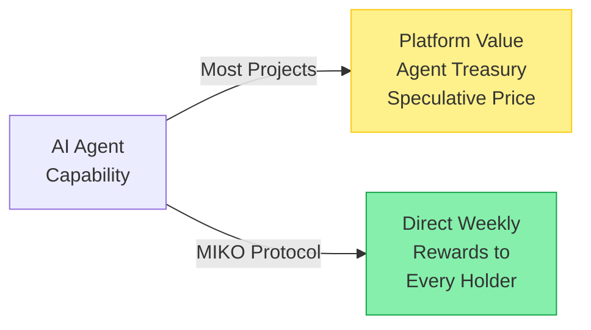

# Intelligence That Pays

The AI agent era is here. It is not hype. It is not a bubble. It is a genuine technological shift.

OpenClaw gave anyone the ability to run an autonomous agent on their laptop. Coinbase gave agents their own wallets. Ethereum gave agents protocol-level permissions. Virtuals built an economy where agents hire each other. The x402 protocol enabled 115 million machine-to-machine payments. The infrastructure is real. The capabilities are real.

**What is not yet real, for most projects, is the link between all of this capability and the token holder's wallet.**

The AI agent market has achieved an extraordinary paradox: more agents, more autonomy, more economic activity — and yet CoinGecko data shows that AI tokens returned -50.18% in 2025 while capturing the second-highest investor mindshare in all of crypto. Platforms captured value. Agents accumulated treasuries. Frameworks enabled ecosystems. But the person who held the token — the most basic form of participation in the crypto market — saw their position decline.

---

**MIKO Protocol exists because this gap is not inevitable. It is a design choice — and MIKO chose differently.**

The \$MIKO token is not a governance token, a utility token, or a speculative vehicle for an AI narrative. It is the **medium through which an AI's analytical output is converted into financial returns for its holders**. Every week:

1. Miko's intelligence stack processes hundreds of data points across KOL activity, community sentiment, and on-chain metrics
2. A multi-source fact-checking pipeline verifies information before it influences decisions
3. A self-improving ML system selects the optimal reward token
4. Miko's on-chain module purchases the selected token with accumulated tax revenue
5. All eligible holders receive the purchased tokens as an airdrop

This is a measurable system. Every selection is recorded with its outcome — the token selected, its price performance at 24 hours and 7 days, and a composite outcome score that feeds back into the AI's learning. MIKO's intelligence is not a claim to be taken on trust. It is a track record that accumulates with every weekly cycle.

---

MIKO does not claim to be the most autonomous agent in the market. It does not deploy thousands of agents. It does not build infrastructure for others. It does not compete on spectacle.

MIKO does one thing: **it converts intelligence into money in your wallet**.

The AI agent space is building increasingly powerful tools. MIKO is building the pipeline that ensures the output of those tools reaches the people who believed in them.

That is the standard for intelligent assets. And the blockchain keeps the score.
