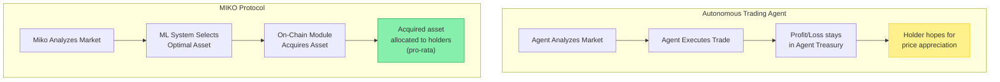

# Competitive Landscape

The AI agent crypto market has grown into a multi-billion dollar vertical, spanning platforms, agent frameworks, and autonomous trading agents. MIKO Protocol occupies a distinct position within this landscape as an AI-curated Solana index whose weekly selection is acquired on-chain allocated pro-rata to eligible holders. 

## 1. The Landscape

| Project | Agent Capability | Mechanism | Holder Receives |
| :--- | :--- | :--- | :--- |
| **MIKO Protocol** | Weekly AI-curated asset selection | Transaction tax → on-chain acquisition → pro-rata allocation | **Allocated asset position** |
| **AIXBT** | 400+ KOL monitoring, real-time insights | None | Analysis to read |
| **Virtuals Protocol** | 18,000+ agents, \$479M aGDP | Protocol-level revenue capture | Staking rewards (indirect) |
| **Theoriq** | \$25M TVL autonomous vault management | Vault depositor returns | Yield (for depositors, not token holders) |
| **elizaOS** | Most-forked agent framework | Plugin development incentives | Developer ecosystem participation |

## 2. Detailed Analysis

### MIKO vs. AIXBT: Execution vs. Commentary

AIXBT is the most successful AI KOL in crypto. It monitors 400+ influencers hourly, combines data from CoinGecko and DeFiLlama, and delivers analysis to 445,000+ followers. It plans to introduce AI-guided investment tools on a paid subscription model, with fees used for token buybacks.

**Where AIXBT stops, MIKO starts.**

```mermaid
graph TD
    subgraph "AIXBT Flow"
        A1["Monitor 400+ KOLs"] --> A2["Analyze Trends"]
        A2 --> A3["Publish Analysis on X"]
        A3 --> A4["Holder reads tweet"]
        A4 --> A5["Holder decides<br/>whether to act"]
        A5 --> A6["Holder bears<br/>100% execution risk"]
    end
    subgraph "MIKO Flow"
        M1["Monitor KOLs +<br/>Community + On-Chain"] --> M2["Analyze & Fact-Check<br/>(6-Provider Pipeline)"]
        M2 --> M3["ML-Driven<br/>Asset Selection"]
        M3 --> M4["On-Chain Module<br/>Acquires Asset"]
        M4 --> M5["Weekly Allocation<br/>to All Holders"]
    end
    style A6 fill:#fca5a5,stroke:#dc2626
    style M5 fill:#86efac,stroke:#16a34a
```

AIXBT provides intelligence. MIKO provides intelligence **and execution**. The holder doesn't need to interpret the analysis, decide whether to act, time their entry, or manage their trade. Miko's system handles the entire pipeline from analysis to distribution.

Additionally, MIKO's analysis pipeline includes a multi-source fact-checking system that AIXBT lacks. AIXBT aggregates and reports what KOLs are saying. Miko verifies whether what they're saying is accurate before acting on it. When analysis drives real capital allocation, amplifying misinformation translates directly into a bad investment of holder funds.

### MIKO vs. Virtuals Protocol: Holder Value vs. Platform Value

Virtuals Protocol has built the most impressive AI agent platform in crypto. Its metrics are significant:

| Metric | Value (Feb 2026) |
| :--- | :--- |
| Deployed Agents | 18,000+ |
| Total aGDP | \$479.1M USDC |
| Agent Revenue | \$2.67M USDC |
| Jobs Completed | 1.78M |
| Unique Active Wallets | 23,514 |
| Cumulative Protocol Revenue | \$39.5M+ |
| 2026 aGDP Target | \$3B+ |

The Agent Commerce Protocol (ACP) enables agents to discover, hire, and pay each other autonomously. This is a genuine infrastructure achievement.

**The structural difference:** Virtuals has built a thriving *platform economy*. The economic value flows to the *protocol* (\$39.5M+ in cumulative revenue) and is distributed through staking and governance mechanisms. An individual holding a specific Virtuals agent token has no guaranteed mechanism to receive a proportional share of that specific agent's economic output directly in their wallet each week.

MIKO's model is fundamentally different in structure:

$$
\text{Holder Allocation}_{\text{week}} = \frac{\text{Holder Balance}}{\text{Total Eligible Supply}} \times \text{Acquisition Treasury}_{\text{week}}
$$

Every \$MIKO transaction generates a 6% transfer tax. The majority of that tax flows into the acquisition treasury. The treasury acquires the AI-selected asset on-chain. The acquired asset is allocated pro-rata to eligible holders. There is no platform intermediary, no staking requirement, no governance vote needed. Hold the token, receive your weekly allocation.

### MIKO vs. Autonomous Trading Agents

The most advanced AI agents in 2026 can hold wallets, execute DEX trades, manage liquidity, and even deploy smart contracts autonomously. Projects like \$CLAWD feature agents that write their own code and build dApps. Theoriq's Alpha Vault manages \$25M in TVL through autonomous strategies.

**MIKO does not compete on autonomy.** MIKO's agent does not hold its own wallet or execute arbitrary trades. This is a deliberate architectural choice.

The reason is the **alignment problem of autonomous trading agents**: an agent optimized to maximize its own returns does not necessarily maximize what *holder* receive. An autonomous agent managing its own treasury can:
-   Accumulate profits without distributing them
-   Take risks that benefit the agent's performance metrics but expose holders to losses
-   Prioritize strategies that grow the treasury over strategies that benefit holders directly

MIKO solves this by **separating intelligence from execution with structurally enforced allocation**:

The distinction is structural. In autonomous trading agents, the agent accumulates value in its own treasury and the holder's only exposure is through token price speculation. In MIKO, the acquisition treasury is used to acquire the selected asset on-chain and allocate it directly to holders on a pro-rata basis. **The alignment between agent performance and holder allocations is structurally enforced.**

### MIKO vs. Static Reward Tokens (PRINT, IMG)

PRINT and IMG are Solana tax-funded reward tokens that MIKO is most often compared against:

| Feature | Static Models (PRINT, IMG) | MIKO Protocol |
| :--- | :--- | :--- |
| **Distributed Asset** | Fixed (e.g., SOL) | AI-curated weekly selection |
| **Selection Mechanism** | Hardcoded | Self-improving ML pipeline |
| **Market Adaptability** | None | Tracks narrative rotation weekly |
| **Value Proposition** | Predictable but stagnant yield | Trend-capturing alpha + diversification |

PRINT abandoned its reward model. IMG's market cap declined significantly from its peak. The pattern is clear: **static rewards decay because the market doesn't stand still**. MIKO's AI-curated weekly selection takes narrative rotation as its driving input. The force that kills static models becomes the source of MIKO's value.
