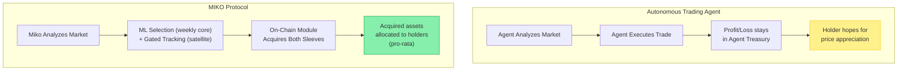

# Competitive Landscape

The AI agent crypto market has grown into a multi-billion dollar vertical, spanning platforms, agent frameworks, and autonomous trading agents. MIKO Protocol occupies a distinct position within this landscape as an AI curation protocol whose selections — a weekly curated core and a continuously tracked attention satellite — are acquired on-chain and allocated pro-rata to eligible holders. This page covers MIKO's position among AI agent projects; for how MIKO compares with other allocation-economy models, see [What MIKO Allocates and Why](../miko-protocol/what-miko-allocates-and-why).

## 1. The Landscape

| Project | Agent Capability | Mechanism | Holder Receives |
| :--- | :--- | :--- | :--- |
| **MIKO Protocol** | Two-speed AI curation (weekly core + gated attention satellite) across community tokens and tokenized equities; intelligence also consumable via live REST API, MCP server, and published open model | Swap tax → threshold claims → dual-sleeve on-chain acquisition → pro-rata allocation | **Allocated asset positions** + callable intelligence |
| **AIXBT** | 400+ KOL monitoring, real-time insights | None | Analysis to read |
| **Virtuals Protocol** | 18,000+ agents, \$479M aGDP | Protocol-level revenue capture | Staking rewards (indirect) |
| **Theoriq** | \$23M TVL autonomous vault management | Vault depositor returns | Yield (for depositors, not token holders) |
| **elizaOS** | Most-forked agent framework | Plugin development incentives | Developer ecosystem participation |

## 2. Detailed Analysis

### MIKO vs. AIXBT: Execution vs. Commentary

AIXBT is the most successful AI KOL in crypto. It monitors 400+ influencers hourly, combines data from CoinGecko and DeFiLlama, and built an X following that peaked above 400,000. Its AIXBT Terminal opened paid subscriptions in May 2025 — project ratings, signals, momentum charts — and has been moving access from token-gating toward subscription tiers.

**Where AIXBT stops, MIKO starts.**

```mermaid
graph TD
    subgraph "AIXBT Flow"
        A1["Monitor 400+ KOLs"] --> A2["Analyze Trends"]
        A2 --> A3["Publish Analysis on X"]
        A3 --> A4["Holder reads tweet"]
        A4 --> A5["Holder decides<br/>whether to act"]
        A5 --> A6["Holder bears<br/>100% execution risk"]
    end
    subgraph "MIKO Flow"
        M1["Monitor KOLs + Community<br/>+ On-Chain + Equity Markets"] --> M2["Analyze & Fact-Check<br/>(6-Provider Pipeline)"]
        M2 --> M3["Two Decision Streams:<br/>Weekly ML Selection +<br/>Gated Attention Tracking"]
        M3 --> M4["On-Chain Module<br/>Acquires Both Sleeves"]
        M4 --> M5["Threshold-Based Allocation<br/>to All Holders"]
    end
    style A6 fill:#fca5a5,stroke:#dc2626
    style M5 fill:#86efac,stroke:#16a34a
```

AIXBT provides intelligence. MIKO provides intelligence **and execution**. The holder doesn't need to interpret the analysis, decide whether to act, time their entry, or manage their trade. Miko's system handles the entire pipeline from analysis to distribution.

Additionally, MIKO's analysis pipeline includes a multi-source fact-checking system that AIXBT lacks. AIXBT aggregates and reports what KOLs are saying. Miko verifies whether what they're saying is accurate before acting on it. When analysis drives real capital allocation, amplifying misinformation translates directly into a bad investment of holder funds.

The tooling difference is the access model. AIXBT sells its terminal as a subscription product and has been moving access away from holding its token. MIKO points the other way: its intelligence surface — a wallet-authenticated [REST API](../technical-architecture/built-with-miko/rest-api) (fact-check, narrative reads, insights, trending narratives, watchlist, persona), an [MCP server](../technical-architecture/built-with-miko/mcp-server) on npm, and a [published open persona model](../technical-architecture/built-with-miko/open-model) on Hugging Face and Ollama — is gated by holding \$MIKO. Access is a holder utility, not a product sold beside the token.

### MIKO vs. Virtuals Protocol: Holder Value vs. Platform Value

Virtuals Protocol has built the most impressive AI agent platform in crypto. Its metrics are significant:

| Metric | Value (Feb 2026) |
| :--- | :--- |
| Deployed Agents | 18,000+ |
| Total aGDP | \$479.1M USDC |
| Unique Active Wallets | 23,514 |
| Cumulative Protocol Revenue | \$39.5M+ |

The Agent Commerce Protocol (ACP) enables agents to discover, hire, and pay each other autonomously. This is a genuine infrastructure achievement.

**The structural difference:** Virtuals has built a thriving *platform economy*. The economic value flows to the *protocol* (\$39.5M+ in cumulative revenue) and is distributed through staking and governance mechanisms. An individual holding a specific Virtuals agent token has no guaranteed mechanism to receive a proportional share of that specific agent's economic output directly in their wallet each week.

MIKO's model is fundamentally different in structure:

$$
\text{Holder Allocation}_{\text{claim}} = \frac{\text{Holder Balance}}{\text{Total Eligible Supply}} \times \left(\text{Core Batch}_{\text{claim}} + \text{Satellite Batch}_{\text{claim}}\right)
$$

Allocations settle **per claim** — every time accumulated fees cross the on-chain threshold — not on a weekly timer; the weekly cycle rotates what the core sleeve buys.

Every \$MIKO trade in the canonical pool generates a 4% swap tax. The majority of that tax flows into the acquisition treasury. The treasury acquires the AI-selected assets on-chain — the weekly selection and the tracked attention leader. The acquired assets are allocated pro-rata to eligible holders. There is no platform intermediary, no staking requirement, no governance vote needed. Hold the token, receive your allocation.

### MIKO vs. Autonomous Trading Agents

The most advanced AI agents in 2026 can hold wallets, execute DEX trades, manage liquidity, and even deploy smart contracts autonomously. Projects like \$CLAWD feature agents that write their own code and build dApps. Theoriq's Alpha Vault manages \$23M in TVL through autonomous strategies.

**MIKO does not compete on autonomy.** MIKO's agent does not hold its own wallet or execute arbitrary trades. This is a deliberate architectural choice. (It is not a retreat from the open-agent ecosystem either: MIKO publishes its persona model as open weights and its tools over MCP, so other agents can consume MIKO's intelligence — what MIKO declines is discretionary control over holder funds.)

The reason is the **alignment problem of autonomous trading agents**: an agent optimized to maximize its own returns does not necessarily maximize what *holders* receive. An autonomous agent managing its own treasury can:
-   Accumulate profits without distributing them
-   Take risks that benefit the agent's performance metrics but expose holders to losses
-   Prioritize strategies that grow the treasury over strategies that benefit holders directly

MIKO solves this by **separating intelligence from execution with structurally enforced allocation**:

```mermaid
graph TD
    subgraph "Autonomous Trading Agent"
        T1["Agent Analyzes Market"] --> T2["Agent Executes Trade"]
        T2 --> T3["Profit/Loss stays<br/>in Agent Treasury"]
        T3 --> T4["Holder hopes for<br/>price appreciation"]
    end
    subgraph "MIKO Protocol"
        M1["Miko Analyzes Market"] --> M2["ML Selection (weekly core)<br/>+ Gated Tracking (satellite)"]
        M2 --> M3["On-Chain Module<br/>Acquires Both Sleeves"]
        M3 --> M4["Acquired assets<br/>allocated to holders<br/>(pro-rata)"]
    end
    style T4 fill:#fef08a,stroke:#facc15
    style M4 fill:#86efac,stroke:#16a34a
```

The distinction is structural. In autonomous trading agents, the agent accumulates value in its own treasury and the holder's only exposure is through token price speculation. In MIKO, the acquisition treasury is used to acquire the selected assets on-chain and allocate them directly to holders on a pro-rata basis. **The alignment between agent performance and holder allocations is structurally enforced.**
