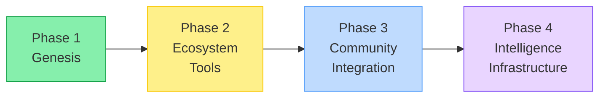
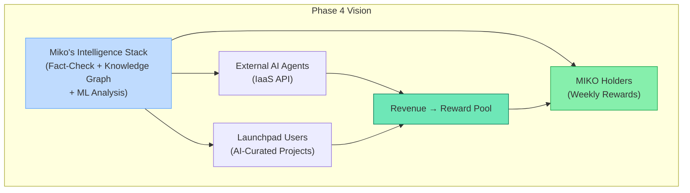

# Project Roadmap

The MIKO Protocol will continuously grow and evolve through a clear, phased development plan. Each phase builds on the success of the previous one, with the AI model being continuously enhanced throughout all stages. The ultimate goal is to build the standard for AI-driven value transfer to token holders.

## Phase 1: Genesis and Protocol Launch (Current)

-   **Launch Miko AI Agent v1.0:** Activate the initial version of the AI agent with features for collecting KOL tweets, building a knowledge base, multi-source fact-checking, and selecting weekly reward tokens via the Reward Selection Algorithm.
-   **Deploy MIKO Token Smart Contract:** Deploy the MIKO token and reward distribution contracts using the `Token-2022` standard on the Solana mainnet.
-   **Initial Liquidity Provision and Trading Start:** Provide initial liquidity on major Solana DEXs and commence trading of the \$MIKO token.
-   **Commence Weekly Reward Cycle:** Start the regular weekly dynamic reward distribution cycle, beginning with the selection of the first weekly reward token.

## Phase 2: Ecosystem Tools and Insight Enhancement

-   **Launch 'MIKO's Insight' Dashboard:** Release an analytics dashboard that transparently provides the community with data collected and analyzed by the AI.
-   **Reward Hall of Fame:** Transparently track and record the performance of all tokens selected as weekly rewards to demonstrate the AI's analytical capabilities.
-   **KOL Spotlight:** Based on the analysis of 400+ KOL tweets, highlight the individual who provided the most narrative inspiration for the week, offering new perspectives to the community.
-   **Formalize Ecosystem Partnership Program:** Establish official partnerships with projects selected as weekly reward tokens. Position MIKO as a hub of collaboration within the Solana ecosystem through joint AMAs, cross-promotions, and more.

## Phase 3: Community Web3 Integration and Participation Rewards

-   **Launch 'MIKO's Circle' Platform:** Build an innovative platform that connects users' social activities (X) with their on-chain activities (wallet).
-   **Introduce Participate-to-Earn Mechanism:** Through the platform, select outstanding community members who have interacted most actively with Miko or created the most inspiring posts during the week, and provide them with differentiated benefits such as \$MIKO token airdrops. This will serve as the foundation for forming an 'ambassador' group that actively contributes to the ecosystem, beyond just being holders.
-   **Multi-Platform Expansion:** Starting with X, gradually expand Miko's sphere of activity to new social platforms like Farcaster.

## Phase 4: Intelligence Infrastructure

The long-term vision is to evolve MIKO from a single-application protocol into **intelligence infrastructure** that serves the broader AI agent ecosystem.

-   **Intelligence-as-a-Service (IaaS) API:** Expose Miko's fact-checking pipeline and market analysis capabilities as an API that other autonomous agents can consume. As the AI agent ecosystem grows — with agents trading autonomously, deploying contracts, and managing treasuries — the demand for verified, high-quality market intelligence will grow with it. Agents that trade based on unverified information create systemic risk. Miko's multi-source fact-checking and knowledge graph can serve as a **trust layer for other agents**, not just for MIKO holders.
-   **AI-Curation Launchpad:** Leverage the AI's analytical power to assess new projects launching in the Solana ecosystem in real-time, providing an AI-curated filter for investors navigating the overwhelming volume of new token launches. Revenue generated from this launchpad will further fund the reward pool, creating an additional flywheel for the ecosystem.

This evolution positions MIKO at the intersection of the two most valuable trends in the AI agent market: the demand for autonomous agents (which creates the supply of agents that need intelligence) and the demand for trustworthy information (which creates the market for Miko's fact-checking and analysis capabilities). Every new agent that needs verified data before making a financial decision is a potential consumer of Miko's intelligence infrastructure — and the revenue from that consumption flows back to \$MIKO holders.
