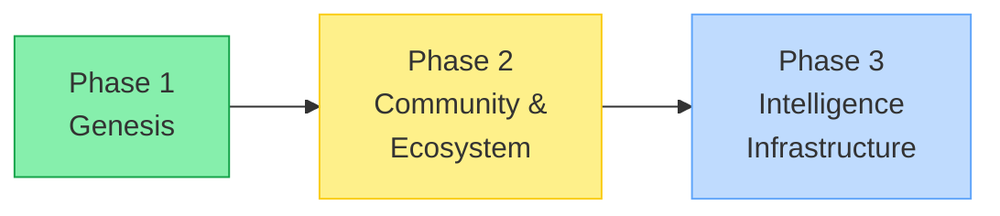
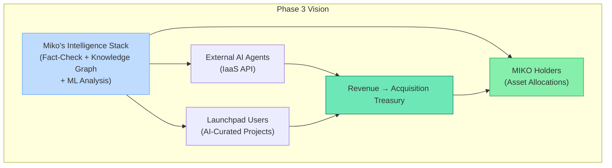

# Project Roadmap

The MIKO Protocol will continuously grow and evolve through a clear, phased development plan. Each phase builds on the success of the previous one, with the AI model being continuously enhanced throughout all stages. The ultimate goal is to build the standard for AI-curated weekly asset selection and allocation to token holders.

```mermaid
graph LR
    P1["Phase 1<br/>Genesis"] --> P2["Phase 2<br/>Community &<br/>Ecosystem"]
    P2 --> P3["Phase 3<br/>Intelligence<br/>Infrastructure"]
    style P1 fill:#86efac,stroke:#16a34a
    style P2 fill:#fef08a,stroke:#facc15
    style P3 fill:#bfdbfe,stroke:#60a5fa
```

## Phase 1: Genesis and Protocol Launch (Current)

-   **Miko AI Agent:** KOL tweet collection, knowledge base construction, multi-source fact-checking, and weekly asset selection via the Selection Algorithm.
-   **MIKO Token and Protocol Contracts:** Deployment on the Robinhood Chain mainnet.
-   **Initial Liquidity and Trading:** Initial liquidity in the canonical MIKO/ETH pool and the start of \$MIKO trading.
-   **Weekly Allocation Cycle:** Weekly selection, acquisition, and allocation to holders, with the acquisition treasury split between the core selection and the attention satellite sleeve.
-   **'MIKO's Insight' Dashboard and Selection Track Record:** Public analytics covering the data Miko collects and the recorded performance of every weekly selection.
-   **'Miko's Circle' Leaderboard:** The platform connecting users' X activity with their on-chain wallets, opening with the Season 1 airdrop.
-   **REST API, MCP Server, and Open Model:** Wallet-authenticated access to fact-checking, narrative reads, insights, watchlist, and persona, with the persona model published as open weights on Hugging Face and Ollama.

## Phase 2: Community and Ecosystem Expansion

-   **KOL Spotlight:** Weekly recognition of the KOL whose posts provided the most narrative inspiration, drawn from the 500+ accounts Miko analyzes.
-   **'Miko's Circle' Seasons:** Recurring leaderboard seasons with benefits for the most active contributors, growing into an ambassador group.
-   **Ecosystem Partnership Program:** Official partnerships with projects selected as weekly allocation assets, including joint AMAs and cross-promotions within the Robinhood Chain ecosystem.

## Phase 3: Intelligence Infrastructure

The long-term vision is to evolve MIKO from a single-application protocol into **intelligence infrastructure** that serves the broader AI agent ecosystem.

-   **Intelligence-as-a-Service (IaaS) API:** Extend the already-live holder REST API and MCP server into infrastructure that external autonomous agents consume at scale. As the AI agent ecosystem grows(with agents trading autonomously, deploying contracts, and managing treasuries), the demand for verified, high-quality market intelligence will grow with it. Agents that trade based on unverified information create systemic risk. Miko's multi-source fact-checking and knowledge graph can serve as a **trust layer for other agents**, not just for MIKO holders.
-   **AI-Curation Launchpad:** Leverage the AI's analytical power to assess new projects launching in the Robinhood Chain ecosystem in real-time, providing an AI-curated filter for investors navigating the overwhelming volume of new token launches. Revenue generated from this launchpad will further fund the acquisition treasury, creating an additional flywheel for the ecosystem.

```mermaid
graph TD
    subgraph "Phase 3 Vision"
        A["Miko's Intelligence Stack<br/>(Fact-Check + Knowledge Graph<br/>+ ML Analysis)"]
        A --> B["MIKO Holders<br/>(Asset Allocations)"]
        A --> C["External AI Agents<br/>(IaaS API)"]
        A --> D["Launchpad Users<br/>(AI-Curated Projects)"]
        C --> E["Revenue → Acquisition Treasury"]
        D --> E
        E --> B
    end
    style A fill:#bfdbfe,stroke:#60a5fa
    style B fill:#86efac,stroke:#16a34a
    style E fill:#6ee7b7,stroke:#047857
```

This evolution positions MIKO at the intersection of the two most valuable trends in the AI agent market: the demand for autonomous agents (which creates the supply of agents that need intelligence) and the demand for trustworthy information (which creates the market for Miko's fact-checking and analysis capabilities). Every new agent that needs verified data before making a financial decision is a potential consumer of Miko's intelligence infrastructure, and the revenue from that consumption flows back to \$MIKO holders.
