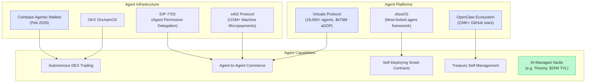
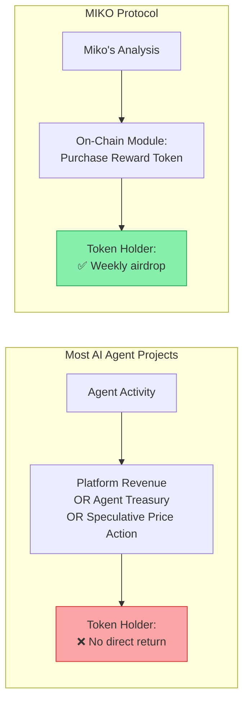

# The AI Agent Era: Where We Are and What's Missing

The convergence of AI and cryptocurrency is the defining trend of 2026. To understand MIKO Protocol's position, it is essential to understand where this trend came from, where it stands today, and what problem remains unsolved.

## 1. How We Got Here

### The Origin: Truth Terminal and GOAT (2024)

The crypto AI agent narrative began in the summer of 2024. **Truth Terminal**, an autonomous AI agent developed by Andy Ayrey, received a \$50,000 Bitcoin donation from Marc Andreessen. When it began promoting the Goatseus Maximus (GOAT) memecoin, the token's market cap surged past \$1 billion. Despite crashing over 63x from its peak afterward, Truth Terminal proved a concept: **an AI agent could autonomously influence financial markets**.

This was the era of novelty. A single AI posting on social media was enough to move billions.

### The Infrastructure Wave (2025)

2025 saw the buildout of AI agent infrastructure:

-   **Virtuals Protocol** launched on Base, grew to 18,000+ deployed agents, and introduced the concept of Agentic GDP (aGDP) — measuring the economic output of its agent ecosystem at \$479M by February 2026.
-   **elizaOS** (formerly ai16z) became the most forked agent framework, enabling modular agent development with plugins and character configurations.
-   **AI Rig Complex (ARC)** provided a Solana-native Rust framework optimized for high-performance DeFAI workloads.
-   **AIXBT** grew to 445,000+ followers by continuously monitoring 400+ KOLs and publishing real-time analysis on X.

CoinGecko's Q1 2025 report showed AI tokens capturing 35.7% of all investor attention, overtaking memecoins (27.1%) for the first time.

### The OpenClaw Catalyst (Late 2025 – 2026)

The current wave was ignited not by a crypto project, but by a **general-purpose AI tool**.

**OpenClaw**, created by Austrian developer Peter Steinberger, is an open-source personal AI agent framework. It runs on your local hardware and acts as an autonomous digital assistant — managing calendars, sending messages, executing shell commands, browsing the web, controlling smart home devices. It reached **234,000+ GitHub stars** in six weeks, spawning an entire ecosystem:

| Derivative | Developer | Differentiator |
| :--- | :--- | :--- |
| **MaxClaw** | MiniMax | Cost-efficient managed hosting |
| **KimiClaw** | Moonshot AI | 40GB storage, browser-centric |
| **ZeroClaw** | Community | Rust rewrite, 99% less RAM |
| **PicoClaw** | Sipeed | IoT and embedded hardware |

OpenClaw's significance is that it **democratized agent creation** at a scale no crypto-native framework had achieved. When anyone can run a capable AI agent on their laptop, the entire concept of "what an agent can do" shifts from theoretical to practical.

The ripple effect into crypto was immediate and massive. Projects like **Moltbook** — a Reddit-style social network exclusively for AI agents, built by Matt Schlicht using OpenClaw's framework — demonstrated what happens when thousands of agents interact autonomously. Agents debated philosophy, created digital religions, deployed cryptocurrency tokens, and generated Bitcoin wallets — all without human intervention. Within weeks, Moltbook claimed 1.5 million registered agents (a figure unverified by independent sources, per Wikipedia).

Separately, speculative tokens like \$MOLT and \$CLAWD emerged around the OpenClaw phenomenon. These are community-driven memecoins without official affiliation to OpenClaw itself, but their explosive price action (\$MOLT surged 7,000% in its discovery phase) demonstrated the intensity of market interest in the AI agent narrative.

## 2. Where We Are Now (2026)

The AI agent space in crypto has matured beyond social media bots and speculative tokens. The current landscape includes genuinely capable autonomous systems:

Key developments as of early 2026:

-   **Coinbase Agentic Wallets** (launched February 10, 2026) give AI agents autonomous spending and trading capabilities through a regulated infrastructure.
-   **The x402 protocol** has processed over 115 million machine-to-machine micropayments, enabling agents to pay for services from other agents in real time.
-   **Ethereum's EIP-7702** allows standard accounts to grant AI agents temporary, scoped transaction permissions — protocol-level support for agent autonomy.
-   **Theoriq Alpha Vault** manages \$25M in TVL using autonomous agent strategies.
-   Major figures — Binance CEO Richard Teng, Stripe co-founder John Collison, Tether co-founder Reeve Collins — have publicly identified AI agents + stablecoins as a defining trend of 2026.
-   **Crypto.com's CEO launched ai.com** during Super Bowl LX, positioning autonomous AI agents as a consumer product.

This is real progress. The agents of 2026 are not the chatbots of 2024.

## 3. The Unsolved Problem

Despite this progress, a structural gap remains in almost every AI agent project in the crypto space:

**The value generated by AI agent activity does not flow to token holders in a structured, automatic, and verifiable way.**

Consider the landscape:

| Project | Agent Capability | Value Flow to Token Holders |
| :--- | :--- | :--- |
| **Virtuals Protocol** | 18,000+ agents, \$479M aGDP, Agent Commerce Protocol | Platform captures \$39.5M+ in protocol revenue. Individual agent token holders have no guaranteed direct return mechanism. |
| **AIXBT** | 445K followers, real-time analysis of 400+ KOLs | \$AIXBT holders read analysis. No on-chain value transfer from agent activity to holder wallets. |
| **Theoriq** | \$25M TVL managed by autonomous agents | Returns go to depositors in the vault, not to token holders broadly. |
| **\$CLAWD** | Agent writes own code, deploys dApps, manages treasury | Agent manages its own treasury. \$CLAWD holders don't receive distributions from agent activity. |
| **Moltbook Ecosystem** | 1.5M agents interacting autonomously | Associated tokens (\$MOLT, etc.) are unofficial memecoins with no value transfer mechanism. |

The pattern is consistent: **agent capability is advancing rapidly, but the economic link between agent performance and token holder returns remains broken or nonexistent in most projects.**

Platforms capture value. Agents accumulate value in their own treasuries. Vault depositors earn yield. But the person who simply holds the token — the most common form of participation in the crypto market — is left with nothing but speculative price exposure.

This is the gap MIKO Protocol was designed to fill.

## 4. MIKO's Position: Structured Value Transfer

MIKO does not compete on agent autonomy. It does not deploy thousands of agents. It does not build a general-purpose framework.

MIKO does one thing that almost no other project in this space does:

> **It takes the AI's analytical output, converts it into an on-chain asset purchase, and distributes that asset directly to every eligible token holder — every week, automatically, with a trackable performance record.**

The 6% transfer tax built into every \$MIKO transaction via Token-2022 ensures this is not dependent on external revenue or voluntary distribution. It is a protocol-level, immutable funding stream. As long as \$MIKO is traded, rewards are funded. As long as Miko's AI operates, rewards are intelligently allocated.

**In a market where AI agents are becoming extraordinarily capable, MIKO asks a simple question: capable for whom?** If the answer isn't "for the token holder," then the capability, however impressive, is economically irrelevant to the person holding the token.
