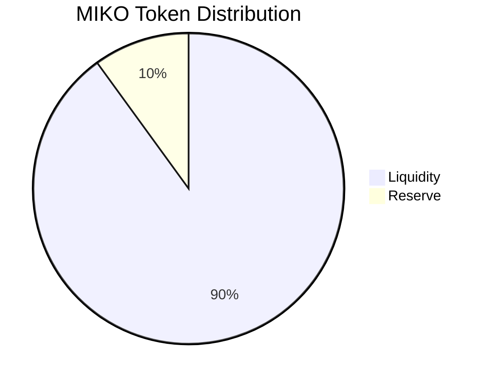

# Tokenomics, Distribution, and Transparency

MIKO Protocol’s tokenomics are designed with fairness, long-term sustainability, and community trust as the highest priorities. The model is straightforward, transparent, and built to mitigate risks associated with team token holdings.

## 1. MIKO Token Specifications

-   **Token Name:** MIKO Protocol
-   **Ticker:** `MIKO`
-   **Blockchain:** Solana (SPL `Token-2022` Standard)
-   **Total Supply:** 1,000,000,000 MIKO
-   **Contract Address:** TBD at deployment

## 2. Initial Distribution

MIKO is committed to a 100% fair launch, ensuring equal opportunity for all participants. There will be **no presales, private sales, or bundled launches.** This approach fosters a strong, organic community from day one.

-   **Liquidity Poll: 90%**
    - At the moment of launch, 90% of the total supply will be permanently locked into the liquidity pool to ensure a deep and stable market.
-   **Ecosystem Reserve: 10%** 
    - This portion is reserved for the protocol's growth, including marketing initiatives, exchange listings, and other ecosystem developments.

## 3. Reserve Management and Team Allocation

To ensure full transparency and align the team's interests with the community's, the Ecosystem Reserve is managed through a strict, publicly verifiable process.

- **Transparent Team Holdings:** The team's allocation is drawn exclusively from the 10% Ecosystem Reserve and will **never exceed 2% of the total supply at any given time.** All team tokens are held in a single, publicly disclosed wallet for complete transparency. This structure provides assurance to the community regarding the low risk of team-initiated token dumping.

- **Cyclical Lock and Burn Mechanism:** The reserve is managed over a 5-month cycle to ensure gradual and responsible use:
    - **Month 1:** At launch, the team may utilize up to 2% of the total supply for initial operations. The remaining portion of the reserve is locked for one month.
    - **Month 2-5:** At the end of each month, the reserve unlocks. Any unused portion of the team's allocation from the previous month is **immediately burned.** The team may then draw a new allocation of up to 2% of the total supply for the upcoming month's operations, and the remainder of the reserve is locked again.
    - **Conclusion:** Through this monthly cycle of use, burning, and re-locking, the entire 10% reserve is projected to be fully utilized for growth or burned within five months, ensuring no long-term overhang of tokens.

This disciplined approach to token management ensures that the team is consistently incentivized to foster the protocol's success while providing the community with unparalleled transparency and security.
