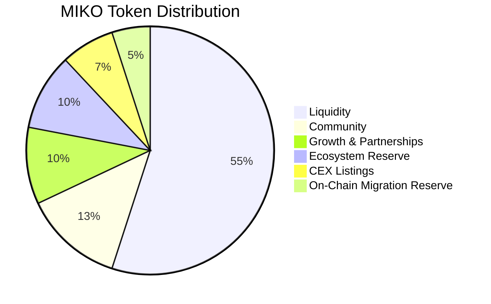

# Tokenomics, Distribution, and Transparency

MIKO Protocol’s tokenomics are designed with fairness, long-term sustainability, and community trust as the highest priorities. The model is straightforward, transparent, and built to mitigate risks associated with team token holdings.

## 1. MIKO Token Specifications

-   **Token Name:** MIKO Protocol
-   **Ticker:** `MIKO`
-   **Blockchain:** Robinhood Chain (Ethereum L2, chain ID 4663) — standard ERC-20 with an immutable Uniswap v4 swap-tax hook on the canonical pool
-   **Total Supply:** 1,000,000,000 MIKO
-   **Contract Address:** TBD at deployment

## 2. Initial Distribution

MIKO is committed to a 100% fair launch, ensuring equal opportunity for all participants. There will be **no presales, private sales, or bundled launches.** No one, including the team, acquires tokens below the market price, and every allocation outside the liquidity pool starts inside an on-chain vesting wallet.

```mermaid
pie
    title MIKO Token Distribution
    "Liquidity" : 55
    "Community" : 13
    "Growth & Partnerships" : 10
    "Ecosystem Reserve" : 10
    "CEX Listings" : 7
    "On-Chain Migration Reserve" : 5
```

-   **Liquidity Pool: 55%**
    - Deposited into the canonical pool at the moment of launch to anchor the market. The LP position is locked for 12 months.
-   **Community: 13%**
    - Airdrop seasons, events, and quests. Season 1, the Miko's Circle leaderboard airdrop, is distributed at launch from this allocation. The remainder is held in on-chain vesting wallets that release 0.3% of the total supply every Tuesday at 00:00 UTC for community programs. Any weekly tranche left unused at the end of its week is burned or added to protocol liquidity.
-   **Growth & Partnerships: 10%**
    - Marketing campaigns, KOL collaborations, and ecosystem integrations. Vests 1% of the total supply every 30 days across ten tranches. Unused tranches are burned or added to protocol liquidity at each cycle.
-   **Ecosystem Reserve: 10%**
    - The protocol's operational reserve: day-to-day operations, marketing support, liquidity injections, and topping up the other allocations when they run short. Vests 2% of the total supply every 30 days across five tranches, under the same discipline: whatever goes unused is burned or added to protocol liquidity.
-   **CEX Listings: 7%**
    - Inventory reserved for centralized exchange listings and the market operations they require. Locked for 3 months as a growth milestone. If no listing is in motion when the vesting wallet matures, the allocation is locked again for another 3 months.
-   **On-Chain Migration Reserve: 5%**
    - MIKO acquired on centralized exchanges enters the holder base without contributing to the acquisition treasury: CEX trades happen off-chain, and wallet transfers on Robinhood Chain are untaxed, so an exchange buyer can join the allocation pool without ever having funded it. The Migration Reserve exists to keep that entry path from diluting on-chain buyers. As exchange-origin holders migrate to self-custody and join the allocations, the reserve contributes to the acquisition treasury on their behalf, keeping funding proportional to the holder base it pays out to. Locked for 3 months alongside the listings inventory; program terms are published when a listing goes live.

## 3. Locked Allocations and Team Exposure

Every allocation outside the liquidity pool is held in its own on-chain vesting wallet: 61 instances of OpenZeppelin's unmodified, audited `VestingWallet` contract, one per release tranche. Each wallet's release date, amount, and beneficiary are fixed in its constructor at deployment. There is no locker platform in the middle, no cancellation function, and no recipient-change function — not even the team can accelerate, redirect, or cancel a schedule. Every wallet address is published, and the entire release plan can be verified on-chain at any time.

- **Team unlocked holdings are capped by the schedule itself.** At any given time, the team holds at most about 3.3% of the total supply in unlocked, spendable form: the current Ecosystem Reserve tranche (2%), the current Growth tranche (1%), and the current weekly Community tranche (0.3%). Everything else remains inside the vesting wallets, out of anyone's reach. The CEX Listings and On-Chain Migration Reserve allocations unlock only at their 3-month milestone and are locked again if unused, so they never add to day-to-day float. The vesting schedule itself removes the inventory that large-scale selling would require.

- **Unused tokens return to the ecosystem.** At the end of each vesting cycle, whatever remains unspent in the team wallet is burned or added to protocol liquidity, and both actions are visible on-chain. Nothing accumulates quietly in a team wallet between cycles.

- **Growth first, then consolidation.** These allocations exist to fuel the project's early growth: community programs, partnerships, and market expansion. As the protocol matures, the same discipline converts any surplus into ecosystem health, through a permanently smaller supply or deeper liquidity.

This structure keeps the team consistently incentivized to grow the protocol while giving the community a verifiable, on-chain guarantee of how every non-liquidity token is handled.
