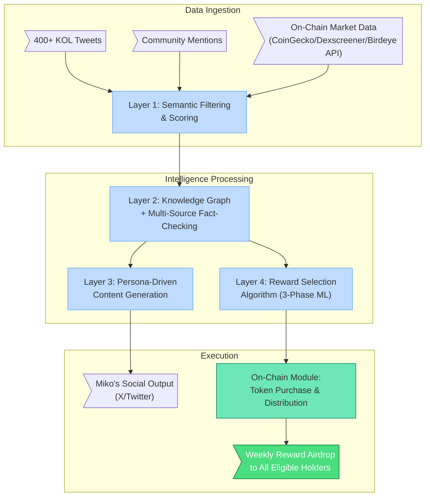
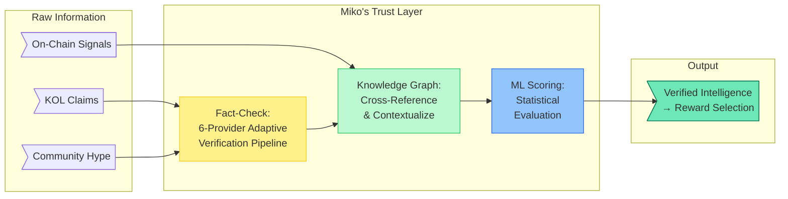

Welcome to the documentation of the **MIKO Protocol**, a Solana-native token ecosystem where an AI agent's intelligence is structurally converted into financial returns for its token holders. Every week, the Miko AI Agent analyzes the Solana ecosystem, selects an optimal reward token, and its on-chain module autonomously purchases and distributes it to all eligible \$MIKO holders.

## 1. The New Era of AI Agents

We are in the middle of a fundamental shift in what AI can do.

The catalyst was **OpenClaw** — an open-source personal AI agent framework created by Peter Steinberger in late 2025. Within six weeks, it amassed over 215,000 GitHub stars, spawned an entire ecosystem of derivatives (MaxClaw, KimiClaw, ZeroClaw, PicoClaw), and fundamentally lowered the barrier to building autonomous AI agents. OpenClaw wasn't built for crypto. It was built for personal automation — managing calendars, sending emails, controlling smart home devices, browsing the web on your behalf. But its impact rippled outward into every industry, including cryptocurrency.

The result has been an explosion of increasingly capable AI agents across the crypto space:

-   **Autonomous trading agents** that hold their own wallets, execute trades on DEXs, and manage portfolios 24/7
-   **Self-improving agents** that write their own code, deploy their own dApps, and manage their own treasuries
-   **Agent-to-agent economies** where AI systems hire each other, pay for services via the x402 protocol (115M+ machine-to-machine micropayments processed by early 2026), and coordinate through protocols like Virtuals' Agent Commerce Protocol
-   **Infrastructure at scale** — Coinbase launched Agentic Wallets, OKX released OnchainOS, Ethereum implemented EIP-7702 for agent permission delegation

This is not hype. This is genuine technological progress. AI agents in 2026 are categorically more capable than anything that existed in 2024.

**But capability and value are not the same thing.**

## 2. The Gap Between Agent Capability and Holder Value

According to CoinGecko's 2025 Annual Report, AI-related crypto narratives captured **22.39%** of total investor mindshare — second only to memecoins. Yet the same narrative posted average returns of **-50.18%**, making it one of the worst-performing categories despite being among the most popular. For context, the AI narrative had delivered nearly +2,940% in average returns just one year prior in 2024.

> ### AI Narrative: Mindshare vs. Returns
>
> | | Mindshare | Avg. Return |
> | :---: | :---: | :---: |
> | **2024** | 15.67% | **+2,940%** |
> | **2025** | 22.39% *(+6.72%p)* | **-50.18%** |
>
> *↑ Attention increased.  ↓ Value decreased.*
>
> *Source: CoinGecko Annual Crypto Industry Report 2025*

The agents got smarter. The agents got more autonomous. The agents got more numerous. **But the token holders didn't get richer.**

Why? Because most AI agent projects solve for agent capability — what can the agent *do*? — without solving for value transfer — how does what the agent does *benefit the person holding the token*?

An agent that autonomously trades on DEXs is impressive. But if the profits stay in the agent's treasury, the token holder receives nothing. An agent that deploys its own dApps is remarkable. But if there's no mechanism connecting that activity to the token's value, the holder is just a spectator. A platform that deploys 18,000 agents is a feat of engineering. But if the platform captures \$39.5M+ in protocol revenue while individual agent token holders receive nothing directly, the scale benefits the platform, not the holder.

**MIKO Protocol was built to close this gap.**

## 3. MIKO's Thesis: Intelligence That Pays

MIKO is a Solana-native token ecosystem built on a single thesis:

> **An AI agent's analytical output should be converted into on-chain financial action that directly benefits its token holders — automatically, every week, with a publicly verifiable track record.**

The system works as follows:

1.  **Miko continuously monitors** hundreds of KOL tweets, community discussions, and on-chain data across the Solana ecosystem
2.  **A multi-source Fact-Checking Engine** verifies claims before they influence any decision — consulting up to 6 independent verification providers with AI-driven verification strategy
3.  **A self-improving ML pipeline** (Bayesian Optimization → Thompson Sampling → CatBoost Learning-to-Rank) selects the optimal reward token each week
4.  **Miko's on-chain module** autonomously purchases the selected token using accumulated tax revenue from a Solana DEX
5.  **All eligible holders** receive the purchased token as an airdrop, proportional to their \$MIKO holdings

This is not a theoretical model. It is a production system. The AI's performance is not measured by follower counts or ecosystem metrics — it is measured by **whether the tokens it selected appreciated in value after distribution**.

### Core Innovations

-   **AI-to-Value Pipeline:** The first protocol where an AI agent's analytical output is directly converted into on-chain token purchases and distributed to holders. Miko doesn't recommend — Miko acts.
-   **Multi-Source Fact Verification:** Before any information influences a reward selection, it passes through an adaptive fact-checking pipeline that consults multiple independent sources and requires evidence convergence. In a market where misinformation moves millions, MIKO's AI verifies before it acts.
-   **Self-Improving Reward Intelligence:** The Reward Selection Algorithm evolves through three statistical phases, automatically transitioning as data accumulates and rolling back if performance degrades. Every selection feeds back into the model, making future selections more precise.
-   **Sustainable On-Chain Funding:** A permanent 6% transfer tax on all \$MIKO transactions, implemented via Solana's Token-2022 standard, provides a continuous and immutable funding stream for holder rewards. As long as \$MIKO is traded, the reward pool is funded.

## 4. The Information Problem MIKO Solves

The Solana ecosystem produces an overwhelming volume of information daily. Countless tokens launch, KOLs broadcast opinions, narratives shift by the hour, and distinguishing signal from noise requires expertise that most individual investors simply don't have. The low transaction costs that make Solana attractive also make it fertile ground for rug pulls, pump-and-dumps, and coordinated manipulation.

Most AI agents contribute to this noise. They aggregate information and broadcast it, adding volume without adding verification. Some actively amplify misinformation when their models lack fact-checking capabilities.

MIKO takes the opposite approach. Rather than broadcasting more information, Miko acts as a **trust layer** between the chaotic information environment and the financial decisions that affect holders:

The result: instead of every holder independently trying to filter signal from noise, Miko does it for the entire community — and backs its judgment with real capital. If Miko's analysis is wrong, it's the protocol's tax revenue that suffers, not individual holders making speculative trades based on unverified information.

## 5. The Evolution of Solana Reward Tokens

MIKO also represents an evolution within the specific category of Solana-based tax-funded reward tokens.

Pioneers like **PRINT** (Print Protocol) introduced the first tax-based reward model on Solana, and **IMG** (Infinity Money Glitch) utilized Solana's Token-2022 standard to implement protocol-level fees. Despite their innovation, both shared a fundamental limitation: **static reward assets**. The reward was always the same token (typically SOL), regardless of what was trending in the market.

The results were predictable. PRINT eventually abandoned its reward model entirely. IMG saw its market cap significantly decrease from its peak. **A fixed reward system cannot keep up with a market defined by constant narrative rotation.**

MIKO solves this by making the reward asset **dynamic** — selected weekly by an AI that tracks exactly those narrative shifts. When the market rotates from DeFi to memecoins to infrastructure plays, MIKO's reward selection rotates with it. Holders don't receive the same asset every week; they receive the asset that the AI's analysis identifies as the strongest opportunity in the current cycle.

Over time, this creates an effect similar to investing in an **AI-curated Solana Ecosystem Index** — a naturally diversified portfolio of tokens, each selected at what the AI determined to be an optimal moment, funded entirely by the protocol's transaction tax.
