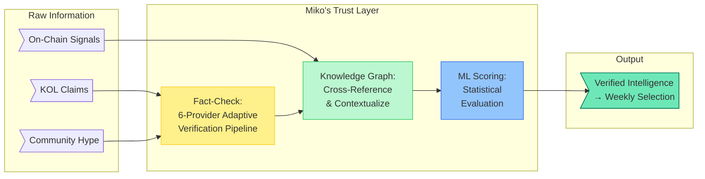

Welcome to the documentation of the **MIKO Protocol**, a Solana-native token ecosystem where an AI agent's intelligence is structurally converted into weekly asset selection, acquisition, and allocation for its token holders. Every week, the Miko AI Agent analyzes the Solana ecosystem, selects the week's asset, and its on-chain module autonomously acquires it and allocates it to all eligible \$MIKO holders pro-rata.

## 1. The Holder Value Gap

The AI agent narrative captured 22.39% of crypto investor mindshare in 2025. AI-related tokens averaged **-50.18%** returns over the same period, one of the worst-performing categories despite being among the most popular (CoinGecko Annual Crypto Industry Report 2025).

> | | Mindshare | Avg. Return |
> | :---: | :---: | :---: |
> | **2024** | 15.67% | **+2,940%** |
> | **2025** | 22.39% *(+6.72%p)* | **-50.18%** |

The pattern across the market is consistent. Agent capability is advancing, but the economic link between agent activity and what the token holder receives is broken in most projects. Platforms capture value through protocol revenue. Agents accumulate value in their own treasuries. Vault depositors earn yield. The holder of an agent's token, with no structured claim on the agent's activity, is left with pure price speculation.

**MIKO Protocol was built to close this gap.**

## 2. MIKO's Thesis: Intelligence That Pays

MIKO is a Solana-native token ecosystem built on a single thesis:

> **An AI agent's analytical output drives weekly on-chain asset selection, acquisition, and allocation to its token holders, with a publicly verifiable track record.**

The system works as follows:

1.  **Miko continuously monitors** hundreds of KOL tweets, community discussions, and on-chain data across the Solana ecosystem
2.  **A multi-source Fact-Checking Engine** verifies claims before they influence any decision, consulting up to 6 independent verification providers with AI-driven verification strategy
3.  **A self-improving ML pipeline** (Bayesian Optimization → Thompson Sampling → CatBoost Learning-to-Rank) selects the week's optimal asset
4.  **Miko's on-chain module** autonomously acquires the selected asset using accumulated tax revenue from a Solana DEX
5.  **The acquired asset is allocated** to all eligible holders' positions, proportional to their \$MIKO holdings

### Core Innovations

-   **AI-to-Value Pipeline:** The first protocol where an AI agent's analytical output is directly converted into on-chain token purchases and distributed to holders. Miko doesn't recommend. Miko acts.
-   **Multi-Source Fact Verification:** Before any information influences a reward selection, it passes through an adaptive fact-checking pipeline that consults multiple independent sources and requires evidence convergence. In a market where misinformation moves millions, MIKO's AI verifies before it acts.
-   **Self-Improving Reward Intelligence:** The Reward Selection Algorithm evolves through three statistical phases, automatically transitioning as data accumulates and rolling back if performance degrades. Every selection feeds back into the model, making future selections more precise.
-   **Sustainable On-Chain Funding:** A permanent 6% transfer tax on all \$MIKO transactions, implemented via Solana's Token-2022 standard, provides a continuous and immutable funding stream for holder rewards. As long as \$MIKO is traded, the reward pool is funded.

## 3. The Trust Layer

Solana sees high-volume, low-cost transactions, which makes it fertile ground for rug pulls, pump-and-dumps, and coordinated manipulation. Miko applies multi-source verification before any information influences a selection:

## 4. A Different Category: AI-Curated Solana Index

Earlier Solana protocols like **PRINT** (Print Protocol) and **IMG** (Infinity Money Glitch) established the tax-funded reward token category, each delivering a fixed reward asset (typically SOL) to holders. The static asset model proved fragile: PRINT eventually abandoned its reward model entirely, and IMG saw its market cap significantly decrease from its peak. **A fixed reward system cannot keep up with a market defined by constant narrative rotation.**

MIKO operates in a different category. Each week the AI agent selects a Solana asset across the entire Solana ecosystem, the protocol acquires it via the accumulated transfer-tax treasury, and the position is allocated pro-rata to eligible \$MIKO holders. When the market rotates from DeFi to memecoins to infrastructure plays, MIKO's selection rotates with it.

This is what an **AI-curated Solana index** means in MIKO's case: a curation methology of fact-checking, ML-driven ranking, and adaptive learning, backed by a publish per-selection track record. The protocol acquires and allocates each week; what each holder does with their allocated asset thereafter is theirs to decide.
