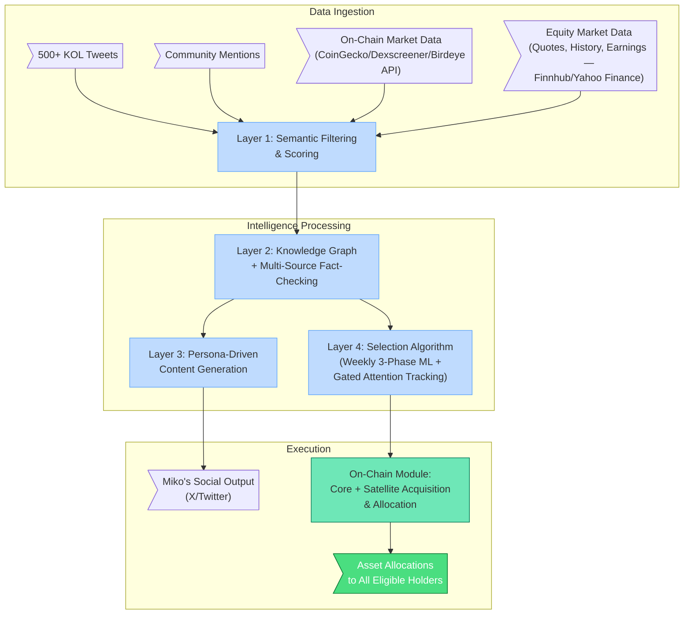
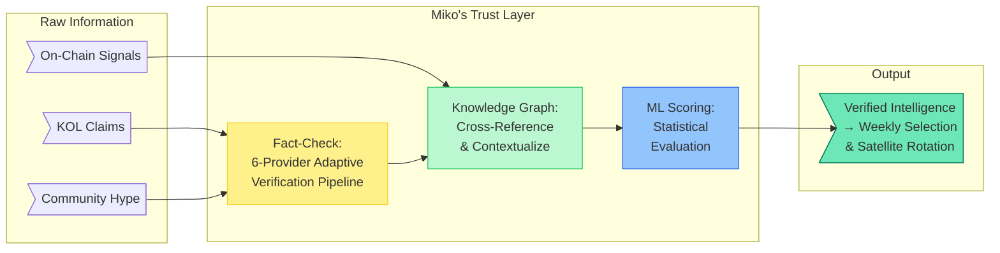

Welcome to the documentation of the **MIKO Protocol**, a token ecosystem native to Robinhood Chain where an AI agent's intelligence is structurally converted into on-chain asset selection, acquisition, and allocation for its token holders. Every week, the Miko AI Agent analyzes the Robinhood Chain ecosystem and selects the week's core asset — while a satellite sleeve continuously tracks the market's live attention leader — and its on-chain module autonomously acquires both and allocates them to all eligible \$MIKO holders pro-rata.

## 1. The Holder Outcome Gap

The AI agent narrative captured 22.39% of crypto investor mindshare in 2025. AI-related tokens averaged **-50.18%** returns over the same period, one of the worst-performing categories despite being among the most popular (CoinGecko Annual Crypto Industry Report 2025).

> | | Mindshare | Avg. Return |
> | :---: | :---: | :---: |
> | **2024** | 15.67% | **+2,940%** |
> | **2025** | 22.39% *(+6.72%p)* | **-50.18%** |

The pattern across the market is consistent. Agent capability is advancing, but the economic link between agent activity and what the token holder receives is broken in most projects. Platforms capture value through protocol revenue. Agents accumulate value in their own treasuries. Vault depositors earn yield. The holder of an agent's token, with no structured claim on the agent's activity, is left with pure price speculation.

**MIKO Protocol was built to close this gap.**

## 2. MIKO's Thesis: Intelligence That Pays

MIKO is a Robinhood Chain-native token ecosystem built on a single thesis:

> **An AI agent's analytical output drives on-chain asset selection, acquisition, and allocation to its token holders — a weekly curated core and a continuously tracked attention satellite — with a publicly verifiable track record.**

The system works as follows:

```mermaid
graph TD
    subgraph "Data Ingestion"
        A>"500+ KOL Tweets"] --> D
        B>"Community Mentions"] --> D
        C>"On-Chain Market Data<br/>(CoinGecko/Dexscreener/Birdeye API)"] --> D
        C2>"Equity Market Data<br/>(Quotes, History, Earnings —<br/>Finnhub/Yahoo Finance)"] --> D
        D["Layer 1: Semantic Filtering<br/>& Scoring"]
    end
    subgraph "Intelligence Processing"
        D --> E["Layer 2: Knowledge Graph<br/>+ Multi-Source Fact-Checking"]
        E --> F["Layer 3: Persona-Driven<br/>Content Generation"]
        E --> G["Layer 4: Selection Algorithm<br/>(Weekly 3-Phase ML +<br/>Gated Attention Tracking)"]
    end
    subgraph "Execution"
        F --> H>"Miko's Social Output<br/>(X/Twitter)"]
        G --> I["On-Chain Module:<br/>Core + Satellite Acquisition<br/>& Allocation"]
        I --> J>"Asset Allocations<br/>to All Eligible Holders"]
    end
    style D fill:#bfdbfe,stroke:#60a5fa
    style E fill:#bfdbfe,stroke:#60a5fa
    style F fill:#bfdbfe,stroke:#60a5fa
    style G fill:#bfdbfe,stroke:#60a5fa
    style I fill:#6ee7b7,stroke:#047857
    style J fill:#4ade80,stroke:#15803d,color:#fff
```

1.  **Miko continuously monitors** hundreds of KOL tweets, community discussions, on-chain data across the Robinhood Chain ecosystem, and — for the chain's tokenized equities — live stock market data: real-time quotes, price history, and earnings calendars, read with awareness of the underlying market's trading sessions
2.  **A multi-source Fact-Checking Engine** verifies claims before they influence any decision, consulting up to 6 independent verification providers with AI-driven verification strategy
3.  **A self-improving ML pipeline** (Bayesian Optimization → Thompson Sampling → CatBoost Learning-to-Rank) selects the week's optimal core asset, while gated attention tracking steers the satellite
4.  **Miko's on-chain module** autonomously acquires the selected assets using the swap-tax revenue accumulated from the canonical MIKO/ETH pool — the weekly selection through the core sleeve, and the market's current attention leader through a continuously rotating satellite sleeve
5.  **The acquired assets are allocated** to all eligible holders' positions, proportional to their \$MIKO holdings

### Core Innovations

-   **AI-to-Allocation Pipeline:** The first protocol where an AI agent's analytical output is directly converted into on-chain acquisitions and allocations to holders. Miko doesn't recommend. Miko acts.
-   **Multi-Source Fact Verification:** Before any information influences a selection, it passes through an adaptive fact-checking pipeline that consults multiple independent sources and requires evidence convergence. In a market where misinformation moves millions, MIKO's AI verifies before it acts.
-   **Self-Improving Selection Intelligence:** The Selection Algorithm evolves through three statistical phases, automatically transitioning as data accumulates and rolling back if performance degrades. Every selection feeds back into the model, making future selections more precise.
-   **Two-Speed Allocation:** The acquisition treasury runs two sleeves at once — a weekly core sleeve carrying the AI's verified selection, and a continuously rotating satellite sleeve tracking the chain's live community attention leader behind evidence-based safety gates. Holders hold one token and receive both rhythms of the market.
-   **Sustainable On-Chain Funding:** A fixed 4% swap tax on every \$MIKO trade in the canonical pool, enforced by an immutable Uniswap v4 hook, provides a continuous funding stream for acquisitions. There is no pool fee on top of it, and wallet-to-wallet transfers are untaxed. As long as \$MIKO is traded, the acquisition treasury is funded.
-   **An Intelligence Surface You Can Call:** MIKO's capabilities are not locked inside the protocol. Holders can call the fact-checker, narrative reads, insights, and Miko's own voice through a live wallet-authenticated [REST API](technical-architecture/built-with-miko/rest-api) and [MCP server](technical-architecture/built-with-miko/mcp-server), and Miko's persona model is published as [open weights](technical-architecture/built-with-miko/open-model) on Hugging Face and Ollama — downloadable and runnable by anyone.

## 3. The Trust Layer

Robinhood Chain's DEX market is young and moving extraordinarily fast. New tokens, new narratives, and unverified claims appear daily, and information quality has not caught up with trading volume. Miko applies multi-source verification before any information influences a selection:

```mermaid
graph LR
    subgraph "Raw Information"
        A>"KOL Claims"]
        B>"Community Hype"]
        C>"On-Chain Signals"]
    end
    subgraph "Miko's Trust Layer"
        D["Fact-Check:<br/>6-Provider Adaptive<br/>Verification Pipeline"]
        E["Knowledge Graph:<br/>Cross-Reference<br/>& Contextualize"]
        F["ML Scoring:<br/>Statistical<br/>Evaluation"]
    end
    subgraph "Output"
        G>"Verified Intelligence<br/>→ Weekly Selection<br/>& Satellite Rotation"]
    end
    A --> D
    B --> D
    C --> E
    D --> E
    E --> F
    F --> G
    style D fill:#fef08a,stroke:#facc15
    style E fill:#bbf7d0,stroke:#22c55e
    style F fill:#93c5fd,stroke:#2563eb
    style G fill:#6ee7b7,stroke:#047857
```

## 4. A Different Category: AI Curation Protocol

MIKO operates as an **AI curation protocol** for the Robinhood Chain DEX market. Each week the AI agent selects an asset across the ecosystem, the protocol acquires it via the accumulated swap-tax treasury, and the position is allocated pro-rata to eligible \$MIKO holders — while a satellite sleeve tracks the market's live attention leader between weekly cycles. When the market rotates from one narrative to the next, MIKO's allocation rotates with it, at both speeds.

Curation here means a methodology, not a metaphor: multi-source fact-checking, ML-driven ranking, and adaptive learning, backed by a published per-selection track record. The protocol acquires and allocates claim after claim, week after week; what each holder does with their allocated assets thereafter is theirs to decide.

Why MIKO allocates the community-driven assets of this chain's DEX market, and how this differs from the fixed-list distribution models that preceded it, is covered in [What MIKO Allocates and Why](../docs/miko-protocol/what-miko-allocates-and-why).
