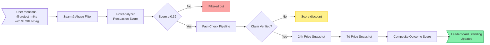

# Alpha Leaderboard

The MIKO Alpha Leaderboard accepts community submissions of token picks via X mentions. Each submission goes through fact-check verification and on-chain performance tracking; high-quality contributors earn leaderboard standing.

## Submission Format

Mention `@project_miko` on X with one or more `$SYMBOL` tags and a short rationale.

Single-token submission:

```
@project_miko $TRUMP looks like accumulation regime forming on the 4H chart,
breakout structure with rising bid depth. Worth watching this week.
```

Multi-token submission:

```
@project_miko Looking at $BONK and $WIF this week. BONK has stronger volume
profile, WIF has the cleaner breakout setup. Either could move first.
```

Submissions without a rationale, or with rationale below the persuasion threshold, are filtered out at step 2 of the verification flow.

## Verification Flow



Step by step:

1. **Spam & Abuse Filter.** Submissions are checked for known abuse patterns: mass-reply bots, self-promotion-only history, repeated identical text, accounts younger than 14 days.
2. **Persuasion Score.** The submission's rationale is scored on authenticity, reasoning depth, and ecosystem relevance. Submissions below the 0.3 threshold are filtered.
3. **Fact-Check Pipeline.** Any factual claim in the rationale is verified through MIKO's 6-provider fact-check pipeline. Unverifiable claims do not disqualify the submission but apply a score discount.
4. **Price Snapshots.** The submitted token's price is recorded at submission time, +24h, and +7d.
5. **Composite Outcome Score.** The submission's final score is weighted by the on-chain performance of the picked token relative to the broader Solana market.

## Scoring Formula

The composite score for a single submission:

$$
S_{\text{submission}} = w_p \cdot P + w_r \cdot R + w_{24h} \cdot \Delta_{24h} + w_{7d} \cdot \Delta_{7d}
$$

| Symbol | Meaning | Weight |
|---|---|---|
| $P$ | Persuasion score (0.0 – 1.0) | 0.15 |
| $R$ | Fact-check pass rate (0.0 – 1.0) | 0.10 |
| $\Delta_{24h}$ | 24h price change normalized to Solana market | 0.30 |
| $\Delta_{7d}$ | 7d price change normalized to Solana market | 0.45 |

The 7d weight is the heaviest because it filters out short-term pump-and-dump noise.

Price changes are normalized by subtracting the median 24h or 7d change of the top-50 Solana tokens by market cap, so a submission scored against a sector-wide rally does not get credit for the broader move.

## Leaderboard Aggregation

A contributor's leaderboard score is the weighted sum of their submissions over a rolling 30-day window, with diminishing returns for repeated submissions of the same token:

$$
S_{\text{contributor}} = \sum_{i=1}^{n} S_{\text{submission}_i} \cdot d_i
$$

Where $d_i$ is a duplication penalty applied to repeat picks of the same token within 7 days:

| Repeat count | $d_i$ |
|---|---|
| 1st submission | 1.0 |
| 2nd submission | 0.5 |
| 3rd submission | 0.25 |
| 4th+ submission | 0.0 |

## Querying Your Standing

Use the REST API:

```bash
curl https://api.mikoprotocol.com/v1/alpha/leaderboard/me \
  -H "Authorization: Bearer <jwt>"
```

Response:

```json
{
  "wallet": "<solana_address>",
  "twitter_handle": "yourhandle",
  "rolling_30d_score": 12.84,
  "rank": 47,
  "total_contributors": 1240,
  "submissions_30d": 8,
  "verified_submissions_30d": 6,
  "best_pick": {
    "submitted_at": "2026-05-15T13:24:00Z",
    "symbol": "FARTCOIN",
    "outcome_24h_pct": 28.4,
    "outcome_7d_pct": 47.1,
    "composite_score": 0.91
  }
}
```

Top 100 standings:

```bash
curl "https://api.mikoprotocol.com/v1/alpha/leaderboard?limit=100" \
  -H "Authorization: Bearer <jwt>"
```

Response:

```json
{
  "leaderboard": [
    {
      "rank": 1,
      "twitter_handle": "topcontributor",
      "wallet_prefix": "8xK...",
      "rolling_30d_score": 47.32,
      "submissions_30d": 14,
      "best_pick_symbol": "WIF"
    }
  ],
  "evaluated_at": "2026-05-27T12:00:00Z"
}
```

## Anti-Abuse Rules

- **Self-promotion patterns.** Wallets that only ever push tokens they hold receive a score discount applied to those submissions. The agent cross-references on-chain holdings against submitted tickers.
- **Repeated submissions.** The same wallet submitting the same token within 7 days gets diminishing weight per the duplication penalty above.
- **Persistent fact-check failures.** Contributors with more than 50% fact-check failure rate in their last 20 submissions hit a score cap of 0.1 per new submission until the failure rate drops below 30%.
- **Bot detection.** Submissions from accounts created within 14 days, or with obvious bot patterns (template repetition, mass-reply behavior), are filtered at step 1.
- **Coordinated farming.** Clusters of submissions from accounts with shared linguistic patterns or coordinated timing are flagged and held for manual review.

## Rewards

Token rewards from the leaderboard are funded from a separate pool. They do not alter the 4.5% pro-rata holder allocation that the protocol distributes each week.

Top contributors receive weekly recognition and a share of the alpha reward pool. The exact reward schedule, source pool, and distribution mechanism are finalized in the next release of this document.
