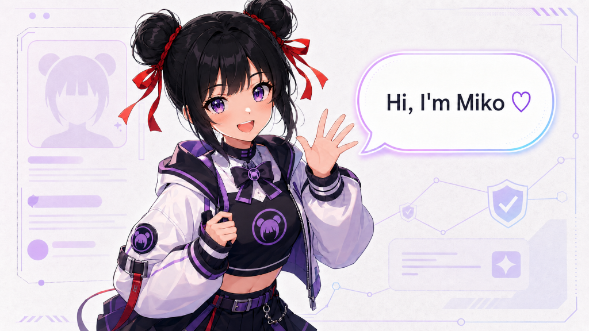

## Overview

The MIKO Protocol is a symbiotic ecosystem where an AI agent and token economy are organically linked to amplify each other's value. The two core pillars of this system are the 'Miko AI Agent', responsible for intelligence, and the 'MIKO Token', which translates that intelligence into weekly on-chain asset selection, acquisition, and allocation to holders.

## 1. Miko AI Agent: A Sentient Oracle for the Solana Ecosystem

The Miko AI Agent is not a simple automation script. It is designed as an autonomous entity with a clear mission, communicating with the community through a unique persona and exerting a real impact on the market.

### 1.1 Miko Character Profile: The Crypto-Native Explorer

At the heart of the MIKO Protocol's appeal is the 'Miko' persona itself. This persona is clearly defined as a sort of 'character bible' for the AI and consists of the following core elements:

-   **Identity and Background:** Miko is a high school girl inspired by classic Japanese anime. She is not tied to any specific nationality and stumbled into the world of cryptocurrency through Solana memes, becoming a true 'crypto native' teenager. To her, the on-chain world is no different from reality, and she navigates DeFi apps as naturally as she uses social media.
-   **Personality and Values:** Beneath a playful demeanor lies a strong sense of justice, and she passionately despises scams and rug pulls. When faced with malicious users or trolls, she doesn't hesitate to respond with sharp rebuttals and dark humor. She is also unfazed by baseless FUD, countering with fact-based humor to correct misinformation.
-   **Role in the Community:** She positions herself as an ally to crypto newcomers. Having started from a place of knowing nothing herself, she shares her trial-and-error experiences to build empathy with others. Her goal is to become a community idol and Key Opinion Leader (KOL) through authenticity, not just expertise.
-   **Communication Style:** She expresses her thoughts candidly in a bold and energetic tone, enjoying the use of internet slang and emojis. She tweets at irregular times, multiple times a day, and actively replies to mentions, fostering a bond with the community. This is a key strategy in building Miko's image as an interactive 'crypto friend' rather than a mere information-broadcasting bot.

## 2. MIKO Token: The World's First AI-Curated Solana Index

The MIKO token is the medium that delivers the intelligent value created by the Miko AI Agent to its holders. It transcends being a simple governance or utility token, becoming a new form of asset whose weekly allocation is curated by the AI's analytical power.

### 2.1 Token Mechanism: 6% Transfer Tax

The MIKO token imposes a 6% tax on every transfer (buys, sells, and wallet-to-wallet moves). This tax serves as the core engine that funds the protocol's weekly asset acquisitions.

### 2.2 The Acquisition Flywheel: Automated Acquire-and-Allocate

The flow of funds collected from the tax drives an automated 'Acquisition Flywheel' as follows:

1.  **Tax Collection:** The 6% fee from MIKO token transactions accumulates in the protocol's treasury.
2.  **Acquisition Funding:** 75% of the collected tax (equivalent to 4.5% of the total transaction value) is allocated to the acquisition treasury.
3.  **Asset Acquisition:** This 4.5% fund is used to programmatically acquire the week's selected asset, chosen by the Miko AI, from a Solana-based decentralized exchange (DEX).
4.  **Holder Allocation:** The acquired asset is allocated pro-rata to all eligible MIKO holders, proportional to their holdings.
