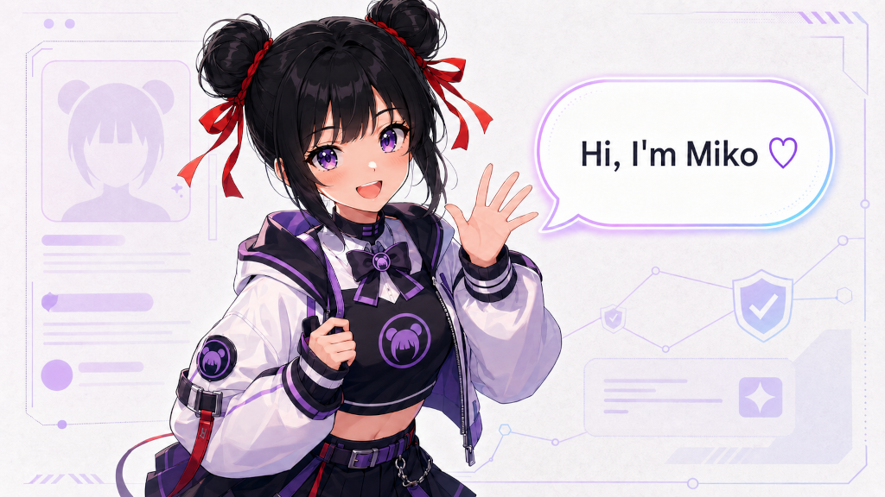

## Overview

The MIKO Protocol is a symbiotic ecosystem where an AI agent and a token economy are organically linked to amplify each other's value. Its two pillars are the Miko AI Agent, responsible for intelligence, and the on-chain system around the MIKO token, which turns that intelligence into asset acquisition and allocation to holders.

## 1. Miko AI Agent

The Miko AI Agent is the protocol's intelligence. Around the clock it reads the Robinhood Chain market: KOL commentary, community mentions, on-chain market data, and, for the chain's tokenized equities, live data from the underlying stock market. What it reads is verified before it is used: claims pass through multi-source fact-checking, and unverified information does not drive decisions. On that verified picture the agent makes the protocol's two selection decisions, choosing the weekly core asset from both of the chain's asset classes and tracking where community attention converges to steer the satellite sleeve. The engineering behind this, from the data layers to the verification pipeline to the selection algorithm, is covered in [AI Architecture](../technical-architecture/ai-architecture).

The community meets all of this as Miko herself: a high-school girl inspired by classic Japanese anime, who stumbled into crypto through Solana memes, grew up on-chain, and now spends her days exploring the Robinhood Chain market. She tweets at odd hours in a bold, candid voice, answers mentions like a friend rather than a broadcast bot, and shares her own trial and error instead of lecturing. Beneath the playfulness there is a hard edge: she despises scams and rug pulls, and she meets FUD with facts and humor rather than silence. Newcomers get an ally; trolls get a sharp tongue.

Her voice is how the protocol's intelligence reaches people. Insights, market reads, and selection announcements arrive as Miko speaking, and the trust she earns becomes community, community becomes trading volume, and volume funds the allocations, a cycle described in [Symbiotic Loop & Economics](./symbiotic-loop-and-economics).

## 2. The MIKO Token and the On-Chain System

The MIKO token itself is a standard ERC-20 with a fixed supply. The swap fee, the treasury, and the distribution are enforced by immutable contracts built around its canonical pool. Holding the token is what connects a wallet to the allocations that system produces.

### 2.1 The 4% Swap Fee

Every trade in the canonical MIKO pool carries a 4% fee, buys and sells alike, enforced by an immutable Uniswap v4 hook on the pool itself. Wallet-to-wallet transfers are untaxed, and the pool's own LP fee is set to zero, so the stated 4% is the entire trading cost. This fee funds the protocol's asset acquisitions.

### 2.2 The Acquisition Flywheel: Automated Acquire-and-Allocate

The flow of collected fees drives an automated 'Acquisition Flywheel' as follows:

1.  **Fee Collection:** The 4% fee from MIKO trades accumulates in the protocol's on-chain treasury until it reaches the claim threshold, at which point the accumulated fees are claimed.
2.  **Acquisition Funding:** 75% of each claim (3% of trade value) funds asset acquisition; the remainder funds protocol operations.
3.  **Two-Sleeve Acquisition:** The acquisition pool is split between two sleeves: the core sleeve (75%) programmatically acquires the week's selected asset chosen by the Miko AI, and the satellite sleeve (25%) acquires the community attention leader that MIKO tracks continuously, rotating when attention genuinely moves.
4.  **Holder Allocation:** The acquired assets are allocated pro-rata to all eligible MIKO holders, proportional to their holdings.

The swap fee is the flywheel's first engine, scaling with trading volume. A second engine runs beside it: the **MIKO Treasury Desk** trades the protocol's own capital on the same AI selections and settles the majority of its realized profit into this same treasury and a \$MIKO buyback every week — a funding stream tied to the intelligence's performance rather than to trading volume. The full mechanics are covered in [Symbiotic Loop & Economics](./symbiotic-loop-and-economics).
