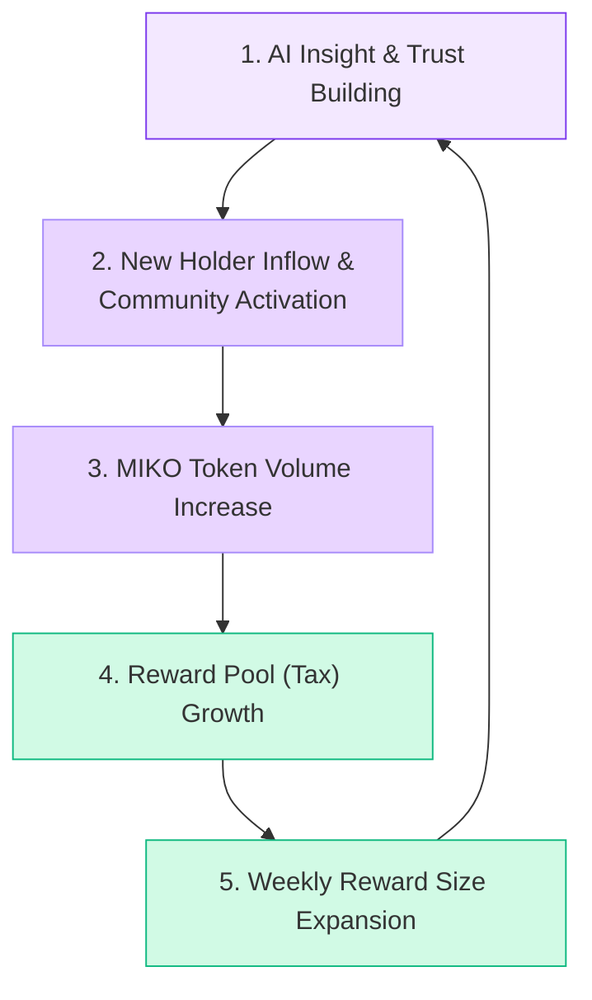

## 1. The Symbiotic Loop: A Self-Reinforcing Value Cycle

The true power of the MIKO Protocol lies in the self-reinforcing feedback loop created by the AI agent and the token economy. This 'Symbiotic Loop' is the core engine that drives the continuous growth of the MIKO ecosystem.

1.  **Trust Building:** The insightful analysis and successful weekly token selections provided by the Miko AI via Twitter and other channels build community trust, which in turn attracts new MIKO token holders.
2.  **Volume Increase:** The influx of new holders and increased activity from existing ones boost the trading volume of the MIKO token.
3.  **Tax Revenue Growth:** Higher trading volume generates more transaction taxes, enriching the protocol's reward pool.
4.  **Reward Size Expansion:** The expanded pool allows for the purchase of a larger quantity of the weekly reward token, resulting in bigger and more valuable airdrops for holders.
5.  **Value Proof and Loop Reinforcement:** Larger rewards serve as a testament to the Miko AI's analytical prowess and the protocol's value, leading to greater trust and more new users, thus strengthening the loop.

Thus, Miko AI's public activities and persona are not just marketing tools; they are core components that directly drive the token economy's flywheel. This unique structure—where AI intelligence earns community trust, that trust generates trading volume, and that volume determines the size of the rewards—is MIKO Protocol's powerful competitive advantage.

## 2. Economic Effects of the Dynamic Reward System

MIKO's dynamic reward system is designed to create multi-layered economic effects for both the protocol and its participants, going beyond simple profit distribution.

-   **Strong Holding Incentive and Value Exposure:** The anticipation of a new reward token each week encourages long-term holding over short-term profit-taking. The eligibility condition of holding at least $100 worth of MIKO forms a stable value base for the token. Furthermore, holders continuously receive a supply of high-potential tokens curated by the AI, instead of a static asset like SOL. This provides an effect similar to investing in a 'Solana Ecosystem Rising Stars Index'. If the value of the reward token appreciates, the benefits are multiplied.
-   **Positive Externalities for the Ecosystem:** Each week, the reward fund (4% of total transaction volume) is used to buy a specific token selected by the AI, creating direct buying pressure on that token. This positions MIKO not just as an individual project, but as a collaborative player that injects liquidity and attention into the broader Solana ecosystem. Other projects may aim to be selected as MIKO's weekly reward token, creating opportunities for natural synergies with the MIKO community.
-   **Sustainable Protocol Funding:** 20% of the total transaction tax (1% of total transaction volume) is allocated to the protocol's operational and development fund. This ensures a stable revenue stream for AI agent operations, server costs, continuous R&D, and marketing activities. As the protocol's trading volume grows, the team's resources grow with it, aligning the long-term interests of the team and the community.
-   **Balanced Token Economy Design:** The potential selling pressure that could arise when reward tokens are distributed is mitigated by changing the target token weekly. The impact on any single token is limited to one week, minimizing shocks to the ecosystem. Additionally, since holders must retain their MIKO tokens to continue receiving rewards, there is less incentive to sell MIKO immediately after receiving a reward, which enhances the protocol's stability.

In conclusion, MIKO's tokenomics is a sophisticated mechanism that converts all trading activity into value for the entire ecosystem. The fees paid by traders are redistributed in a dynamic and engaging way to long-term holders dedicated to the project, driving a virtuous cycle for the whole ecosystem.
