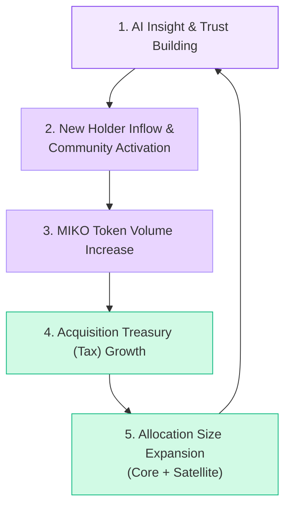
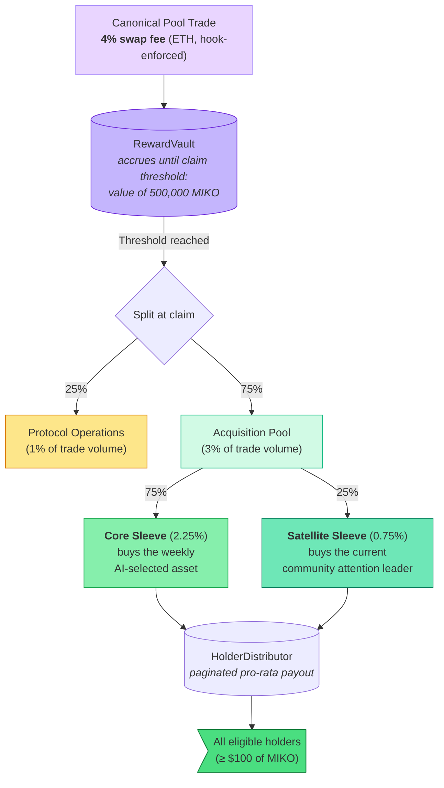

## 1. The Symbiotic Loop: A Self-Reinforcing Value Cycle

The true power of the MIKO Protocol lies in the self-reinforcing feedback loop created by the AI agent and the token economy. This 'Symbiotic Loop' is the core engine that drives the continuous growth of the MIKO ecosystem.

```mermaid
graph TD
    A["1#46; AI Insight & Trust Building"] --> B["2#46; New Holder Inflow &<br/>Community Activation"];
    B --> C["3#46; MIKO Token Volume Increase"];
    C --> D["4#46; Acquisition Treasury (Tax) Growth"];
    D --> E["5#46; Allocation Size Expansion<br/>(Core + Satellite)"];
    E --> A;
    style A fill:#f3e8ff,stroke:#7c3aed
    style B fill:#e9d5ff,stroke:#a78bfa
    style C fill:#e9d5ff,stroke:#a78bfa
    style D fill:#d1fae5,stroke:#10b981
    style E fill:#d1fae5,stroke:#10b981
```

1.  **Trust Building:** The insightful analysis and successful weekly asset selections provided by the Miko AI via Twitter and other channels build community trust, which in turn attracts new MIKO token holders.
2.  **Volume Increase:** The influx of new holders and increased activity from existing ones boost the trading volume of the MIKO token.
3.  **Tax Revenue Growth:** Higher trading volume generates more swap tax, enriching the protocol's acquisition treasury.
4.  **Allocation Size Expansion:** The expanded treasury allows for the acquisition of larger quantities of the selected assets — the weekly core and the attention satellite alike — resulting in bigger and more valuable allocations for holders, delivered more frequently as threshold claims fire faster.
5.  **Value Proof and Loop Reinforcement:** Larger allocations serve as a testament to the Miko AI's analytical prowess and the protocol's value, leading to greater trust and more new users, thus strengthening the loop.

Thus, Miko AI's public activities and persona are not just marketing tools; they are core components that directly drive the token economy's flywheel. This unique structure—where AI intelligence earns community trust, that trust generates trading volume, and that volume determines the size and frequency of the allocations—is MIKO Protocol's powerful competitive advantage.

## 2. The Allocation Engine: Threshold Claims and Two Sleeves

Every MIKO trade in the canonical pool pays a fixed **4% swap fee**, collected in ETH by an immutable Uniswap v4 hook and forwarded directly to the protocol treasury. From there, the flow is deterministic:

```mermaid
graph TD
    T["Canonical Pool Trade<br/><b>4% swap fee</b> (ETH, hook-enforced)"] --> V[("RewardVault<br/><i>accrues until claim threshold:<br/>value of 500,000 MIKO</i>")]
    V -->|"Threshold reached"| S{"Split at claim"}
    S -->|"25%"| O["Protocol Operations<br/>(1% of trade volume)"]
    S -->|"75%"| P["Acquisition Pool<br/>(3% of trade volume)"]
    P -->|"75%"| CORE["<b>Core Sleeve</b> (2.25%)<br/>buys the weekly<br/>AI-selected asset"]
    P -->|"25%"| SAT["<b>Satellite Sleeve</b> (0.75%)<br/>buys the current<br/>community attention leader"]
    CORE --> D[("HolderDistributor<br/><i>paginated pro-rata payout</i>")]
    SAT --> D
    D --> H>"All eligible holders<br/>(≥ $100 of MIKO)"]
    style T fill:#e9d5ff,stroke:#a78bfa
    style V fill:#c4b5fd,stroke:#6d28d9
    style O fill:#fde68a,stroke:#d97706
    style P fill:#d1fae5,stroke:#10b981
    style CORE fill:#86efac,stroke:#16a34a
    style SAT fill:#6ee7b7,stroke:#047857
    style H fill:#4ade80,stroke:#15803d
```

For a trading volume $V$ over any period, the flow decomposes exactly as:

$$
\underbrace{0.04\,V}_{\text{total fee}} \;=\; \underbrace{0.0225\,V}_{\text{core sleeve}} \;+\; \underbrace{0.0075\,V}_{\text{satellite sleeve}} \;+\; \underbrace{0.01\,V}_{\text{operations}}
$$

The two sleeves answer the two speeds of the market:

-   **The core sleeve** carries the week's verified conviction. Once per weekly cycle, the AI's selection — a tokenized stock or a community token — is applied on-chain, and every claim during that week routes the core sleeve into that asset.
-   **The satellite sleeve** carries the market's live attention. It follows MIKO's continuously tracked attention leader and rotates when the leader genuinely changes, behind evidence-based gates that veto one-day spikes and structurally unsafe candidates. The core/satellite ratio can move only inside bounds fixed immutably in the contract.

Why this design fits this chain: Robinhood Chain's daily volume is dominated by its fast-moving community token market, while its weekly narratives rotate through both community tokens and tokenized equities. A single weekly payout reads the second rhythm and misses the first; a pure attention-chaser reads the first and has no conviction anchor. Two sleeves, one treasury, read both — and because claims are **threshold-based rather than timer-based**, the payout cadence itself scales with the market: the busier the chain, the more often holders are paid.

## 3. Economic Effects of the Allocation System

-   **Strong Holding Incentive and Value Exposure:** The anticipation of a new selected asset each week — plus continuous satellite exposure to the market's current attention leader — encourages long-term holding over short-term profit-taking. The eligibility condition of holding at least \$100 worth of MIKO forms a stable value base for the token. Holders continuously receive a supply of high-potential assets curated by the AI, instead of a single fixed payout asset. Each allocation reflects where verified market attention currently is, not where it was at launch.
-   **Positive Externalities for the Ecosystem:** The acquisition pool (3% of total trading volume) creates direct, recurring buying pressure on the assets the community's attention actually points at. This positions MIKO not just as an individual project, but as a collaborative player that injects liquidity and attention into the broader Robinhood Chain ecosystem. Other projects may aim to be selected as MIKO's weekly asset or to earn the attention board's top spot, creating opportunities for natural synergies with the MIKO community.
-   **Sustainable Protocol Funding:** 1% of total trading volume funds protocol operations: AI agent operations, server costs, continuous R&D, and marketing. As the protocol's trading volume grows, the team's resources grow with it, aligning the long-term interests of the team and the community.
-   **Balanced Token Economy Design:** The potential selling pressure that could arise when an allocated asset is distributed is mitigated by rotation itself: the core target changes weekly and the satellite target changes with attention, so the impact on any single token is bounded. Additionally, since holders must retain their MIKO tokens to continue receiving allocations, there is less incentive to sell MIKO immediately after receiving one, which enhances the protocol's stability.

In conclusion, MIKO's tokenomics is a mechanism that converts all trading activity into value for the entire ecosystem. The fees paid by traders are redistributed — at two speeds, through one transparent pipeline — to the long-term holders dedicated to the project.
