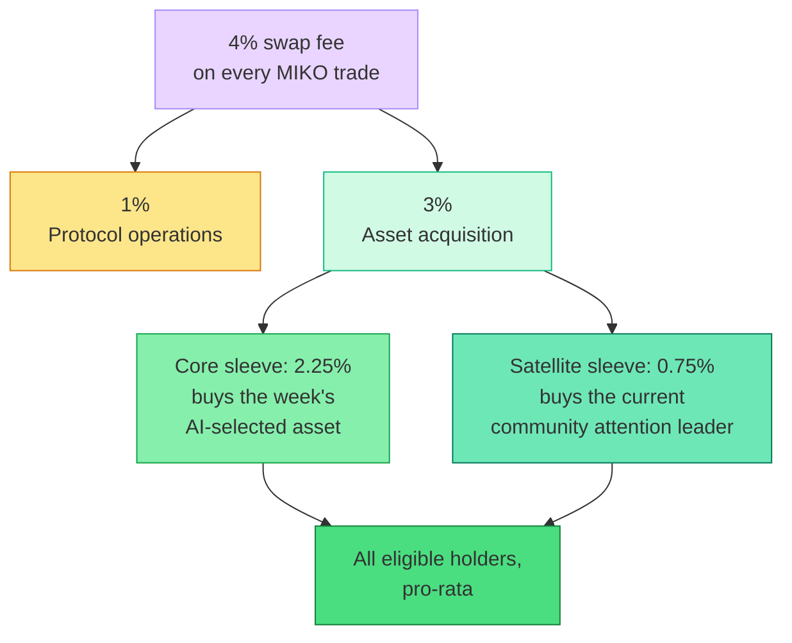

# What MIKO Allocates and Why

Every tax-funded allocation protocol has to answer one question before any other: **when the treasury fills up, what should it buy?** The answer defines who the protocol is for, what its holders actually receive, and whether the model survives a market that never stops rotating. This page explains MIKO's answer, and how it differs from the models that came before it.

## 1. The Fixed-Reward Lineage

Tax-funded holder rewards are one of crypto's oldest retail mechanisms, and their history runs through EVM chains. [reflect.finance (RFI)](https://coinmarketcap.com/currencies/reflect-finance/) introduced fee reflection on Ethereum in late 2020: a percentage of every transfer, redistributed frictionlessly to every holder. [SafeMoon](https://en.wikipedia.org/wiki/SafeMoon) took the model mainstream on BNB Chain in 2021 with a 10% transaction tax split between holder reflections and liquidity. The next step defined the category MIKO descends from: rewards tokens such as [EverGrow](https://finance.yahoo.com/news/evergrow-coin-busd-passive-income-144500920.html) swapped the collected tax into a **different, fixed asset** — stablecoins, majors — and paid that out to holders instead of the token itself.

Thousands of instances followed across every chain, and they shared one arc: explosive early attention, then decay. The payout asset never changed, the market never stopped changing, and a reward stream that ignores narrative rotation gradually became background noise priced at zero. The lesson was not that tax-funded allocation fails, but that **a static answer to "what should the treasury buy" fails**.

## 2. The Same Model, New Asset Class: The Index

**The Index** brought this structure to Robinhood Chain almost as soon as the chain existed, pairing the familiar mechanics with a concept only this chain could offer: a trading tax that buys tokenized stocks and pays them out to holders. On a network only weeks old, it has grown into the most successful allocation project to date — the clear leader of the category it planted here — and it deserves credit for proving that on-chain allocation resonates on this chain.

Structurally, however, it is the fixed-reward model with a new coat of paint. The distribution list is a fixed set of stock tokens registered by the operator, bought in equal slices on a timer. There is no selection intelligence in the pipeline: what holders receive is decided by which tickers the operator has registered, not by any reading of the market.

Here is how the two protocols compare:

| | The Index | MIKO Protocol |
| :--- | :--- | :--- |
| **Total trading cost** | About **4%**: the documented 3% hook fee plus a 1% pool fee that its materials do not mention (`FEE_BPS = 300` in the verified hook, `fee = 10000` in the pool's Initialize event) | Exactly **4%**: `FEE_BPS = 400` in the verified hook, and the pool fee is set to **zero**. There is no cost outside the stated number |
| **Where the cost goes** | **3%** to holders; **1%** undisclosed in its docs and website | **3%** to holders (2.25% weekly core + 0.75% attention satellite), **1%** operations — both stated up front |
| **How the allocated asset is chosen** | Operator-registered list (`addStock()` / `removeStock()`), bought in equal slices — a fixed list, manually maintained | Weekly AI selection across both tokenized stocks and community tokens, plus a continuously tracked attention sleeve, with a published per-selection track record |
| **Can the distribution structure change after launch?** | Yes, by owner call: `setDistributor()` reassigns where purchased assets go, `setMinShareBalance()` moves the eligibility bar, `setRewardsExcluded()` adds and removes reward exclusions in both directions, `setInterval()` changes the payout timer | The destination of purchased assets, the holder split, and the eligibility basis are fixed at deployment with no function to change them. The core/satellite ratio moves only inside immutable contract bounds. The system-account exclusion list is **append-only**: new protocol accounts can be excluded as the infrastructure grows, no exclusion can ever be reversed, and every addition is a public on-chain event |
| **Holder eligibility** | Fixed quantity: 10,000 INDEX | Fixed value: \$100 of MIKO, converted on-chain at claim time. |
| **Distribution trigger** | Fixed timer: accumulated tax is spent and distributed on a set interval (documented as every 15 minutes; the interval itself is owner-adjustable) | Threshold-based: every time accumulated fees reach the claim threshold, the protocol acquires and distributes immediately. The busier the market, the more often it pays. The weekly cycle rotates what the core sleeve buys; the satellite sleeve rotates with community attention itself |

## 3. Two Markets, One Chain

The deeper difference is not mechanical. It is a question of **how much of this chain's market a protocol chooses to read** — and the first weeks of Robinhood Chain made the terrain unusually clear.

The chain launched on July 1, 2026, built for tokenized stocks and real-world assets. Within its first week it ranked in the top five networks by DEX volume with [\$3.1B traded](https://coinmarketcap.com/academy/article/robinhood-chain-hits-top-5-in-dex-volume); within two weeks it had [passed Ethereum in DEX volume](https://finance.yahoo.com/markets/crypto/articles/robinhood-chain-passes-ethereum-dex-034339308.html). But the volume did not come from the asset class the chain was built for. As [CoinDesk put it](https://www.coindesk.com/tech/2026/07/13/robinhood-built-a-blockchain-for-tokenized-stocks-memecoins-took-over): *Robinhood built a blockchain for tokenized stocks — memecoins took over.* Tokenized real-world assets accounted for on the order of \$12.8M on the chain while community tokens dominated activity, led by [a cat-themed token that reached a \$156M market cap in days](https://fortune.com/crypto/2026/07/13/robinhood-chain-memecoin-trading-cash-cat-vlad-tenev-crypto/).

The chain's declared direction, meanwhile, is unambiguous. Robinhood's founder has been explicit that [the future of crypto is in real-world assets](https://coinmarketcap.com/academy/article/robinhood-vlad-tenev-real-world-assets-tokenization-crypto-future), and within weeks of launch the company opened a [public call for builders](https://cryptoadventure.com/robinhood-ceo-calls-on-builders-to-embed-stock-tokens-and-rwas/) to take its stock tokens beyond the Robinhood app — into third-party trading, lending, collateral, and automated finance.

Read plainly: this chain runs on two engines. Its institutional identity and official roadmap are tokenized equities and RWAs; its early growth and daily volume are the community token market — fast, narrative-driven, and larger than every other activity on the chain combined. A protocol that reads only one of the two is reading half the chain.

## 4. MIKO's Answer

This is why MIKO's allocation covers both markets, through two sleeves of one treasury:

**The core sleeve (75% of the acquisition pool)** answers the weekly question: where did verified community attention converge this week? Both of the chain's asset classes are eligible. Official Robinhood stock tokens enter the race directly, registered from the [chain's canonical contract list](https://docs.robinhood.com/chain/contracts/), and are evaluated against the real equity market they mirror rather than by crypto heuristics. Community tokens enter through the market itself: the segment that moves too fast for any fixed list, where unverified information is most expensive, and exactly the environment MIKO's verification was built for — claims are fact-checked against multiple independent sources before they influence a decision, and every selection is published with its track record.

**The satellite sleeve (25% of the acquisition pool)** follows the chain's faster engine. It holds the current leader of the community's attention and rotates when that leadership genuinely changes, with safety checks that keep it out of one-day spikes and structurally unsafe candidates. Holders get direct exposure to the market the chain actually trades, without trading it themselves.

The contrast with the fixed-list model is structural. The Index and its copies cover one asset class with an operator-maintained list; MIKO reads the whole chain and lets that reading decide what the treasury buys. When attention converges on a tokenized stock, holders receive stock exposure. When it converges on a community token, the acquisition routes buying pressure into the asset the community itself chose.

That is what an AI curation protocol means in practice: the treasury buys what verified community attention points at, whether that is a tokenized stock or a community token, and every acquisition and allocation is on-chain for anyone to verify.
