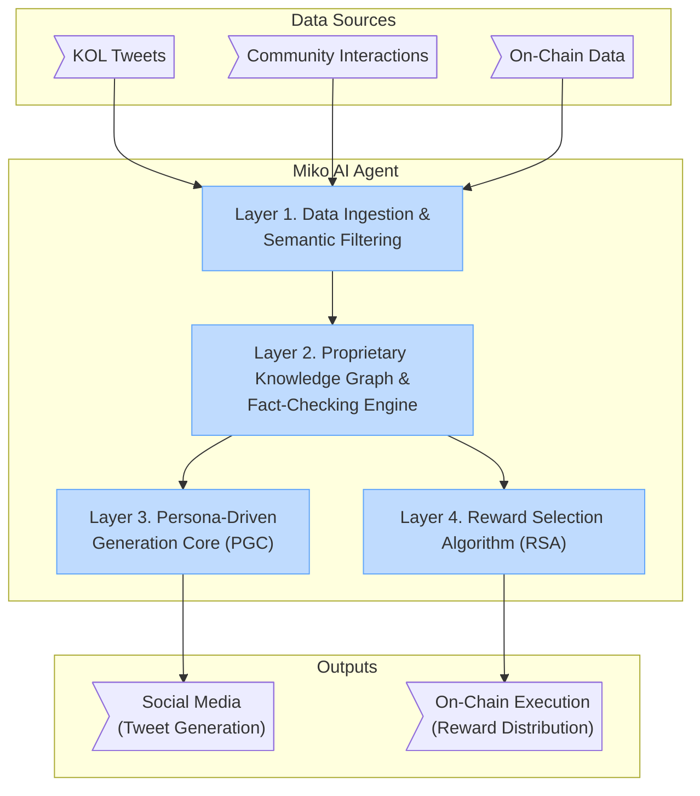
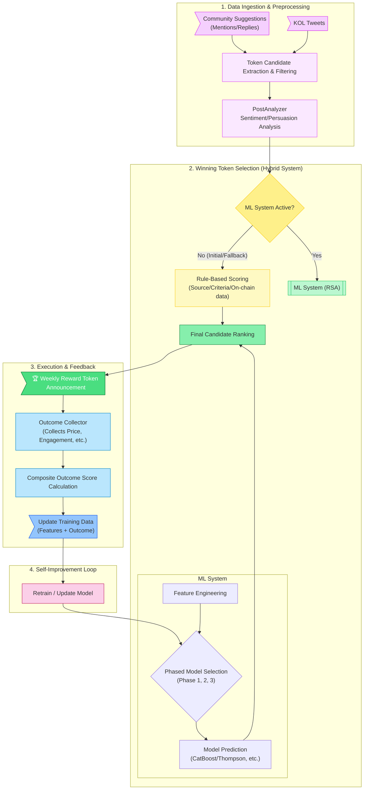
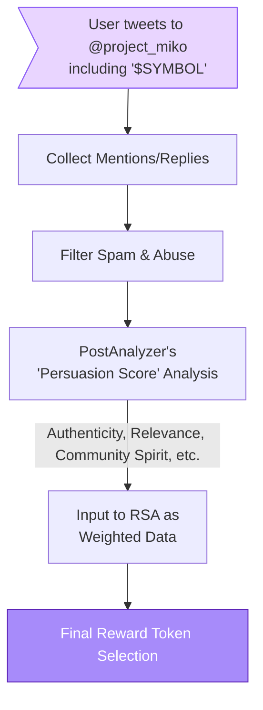

# Technical Architecture: The Inner Workings of the MIKO Protocol

The innovation of the MIKO Protocol is based on the combination of a sophisticated AI agent architecture and smart contracts that leverage the latest technologies of the Solana blockchain.

## Miko AI Agent: A Multi-Layered Intelligence Stack

The Miko AI Agent is not a single model but a complex intelligence system composed of several functional layers. Each layer performs a specific task and interacts organically to arrive at a final decision.

### Layer 1: Data Ingestion and Semantic Filtering Pipeline

This layer is at the forefront of information gathering. It connects to various data sources like the Twitter API to collect raw data in real-time. The collected data is not simply stored but refined through an analysis engine that uses Natural Language Processing (NLP) and heuristic rules. This process filters out irrelevant 'noise' and identifies only discourses directly related to cryptocurrency. Furthermore, each piece of information is scored based on factors like uniqueness, relevance to the blockchain community, and likely engagement, and is finally categorized by topic (e.g., DeFi, NFT, Memecoin) and sentiment (positive, negative, neutral).

### Layer 2: Proprietary Knowledge Graph and Fact-Checking Engine

This is the key element that differentiates Miko from other AI agents. Miko does not simply react to individual tweets; it integrates collected information into a structured 'Knowledge Graph'. This graph maps the complex relationships between tokens, KOLs, market events, and related projects. Important facts and contexts are encoded and stored as vector embeddings for efficient similarity searches. This semantic search capability allows the AI to quickly find past, similar insights for a given query, providing 'background knowledge' in the prompts for generated content, thereby increasing the depth and accuracy of its responses.

Furthermore, a "fact-checking" engine evaluates the credibility of information entering the knowledge graph. It cross-verifies claims on social media with reliable external data sources such as on-chain data, major news APIs, and official project announcements, assigning a weight to the information. The verification result is attached to the knowledge base with a 'truthfulness flag'. This acts as a crucial safeguard against decisions based on false information or manipulated narratives, positioning MIKO as a trusted source of information in a speculation-rampant environment.

### Layer 3: Persona-Driven Generation Core (PGC)

This layer is the generation engine that creates Miko's 'voice'. It focuses on embodying a living personality rather than just generating text. It runs a highly-tuned Large Language Model (LLM) based on the refined and verified knowledge and insights from Layer 2, expressing Miko's diverse persona through sophisticated prompt engineering.

The key is to move away from mechanical responses that maintain a single tone and manner. To achieve this, various **"reaction modes"** are designed. For example, it expresses pure curiosity in a *'Cheerful Explorer'* mode for friendly questions, adds wit in a *'Witty Friend'* mode for humorous interactions, and presents unexpected insights in a *'Sudden Philosopher'* mode for in-depth questions. These Tone Guidelines form the basis of every generated tweet, guiding the LLM to select the most appropriate emotion and style for the situation while maintaining the overall character. This multi-layered approach makes Miko respond dynamically to various situations as if she were a real person, playing a key role in forming a deep bond with the community.

### Layer 4: Reward Selection Algorithm (RSA) - A Hybrid ML and Statistical Approach

This layer is the 'brain' of the reward system, adopting a hybrid approach that starts with a clear rule-based system and gradually evolves into a sophisticated machine learning model as data accumulates. This evolutionary design ensures the system's stability while equipping it with the self-improving ability to adapt optimally to market changes over the long term.

This layer is the 'brain' of the reward system and the core of AI governance, selecting a single token each week. The RSA combines rule-based filtering and multi-stage machine learning strategies to optimize holder value. The process begins by comprehensively tracking token mentions from KOLs and the community, associated sentiment, and on-chain data (e.g., trading volume, price momentum).

Initially, it uses exploratory approaches like Thompson Sampling to learn market reactions to various tokens. As data accumulates, it transitions to sophisticated 'Learning-to-Rank' models like CatBoost. This model predicts which candidate token will achieve the highest 'Composite Outcome Score', a combination of tweet engagement, token price changes, and impact on the MIKO token market.

Most importantly, the 'Engagement Feedback Loop' is crucial. The actual market reaction after a reward token announcement (tweet engagement, price performance, etc.) is fed back into the model. Signals that led to successful selections are reinforced, while patterns from underperforming selections are learned from and avoided. This self-improving learning process ensures that MIKO makes data-driven, rational decisions that become more precisely synchronized with community preferences and market trends over time, going beyond a simple popularity contest.

#### Community Suggestions and Persuasion Analysis

MIKO's reward selection goes beyond passively analyzing data; it is achieved through active interaction with the community. Users can recommend their desired tokens as weekly reward candidates by directly mentioning Miko (`@project_miko`) on X (Twitter) or by including the `$SYMBOL` format in replies to Miko's tweets.

However, MIKO does not rely on simple mention counts or spammy recommendations. The PostAnalyzer module evaluates the content of each recommendation tweet to calculate a *'persuasion_score'*. This score goes beyond simple positive/negative sentiment to analyze, from Miko's persona perspective, how genuine the recommendation is, how well it aligns with the community spirit, and its relevance to the Solana ecosystem. Therefore, repeatedly mentioning the same symbol in a spam-like fashion is ineffective. Instead, well-reasoned and persuasive recommendations have a greater influence on the AI's final decision. This is MIKO's unique method of reflecting the community's voice while quantitatively assessing its quality to make higher-level decisions.

### Summary: Miko as a Living, Autonomous Entity

In summary, if the AI tech stack provides Miko with tools and technology, the persona breathes soul into it. This combination creates an agent that not only processes data and makes decisions but also interacts in a way that humans find relatable and trustworthy. While many crypto projects struggle to maintain continuous community interest, Miko's human-like social presence solves this problem by constantly fulfilling the community's demand for content and interaction.
