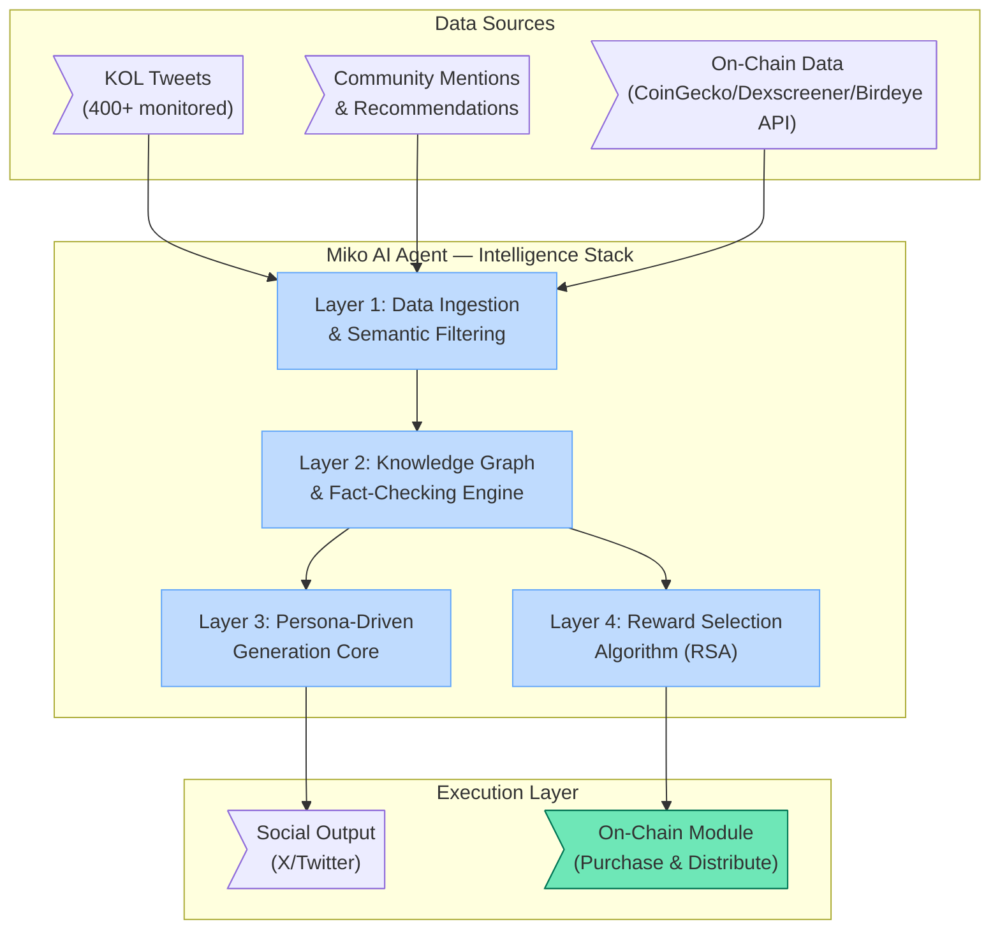
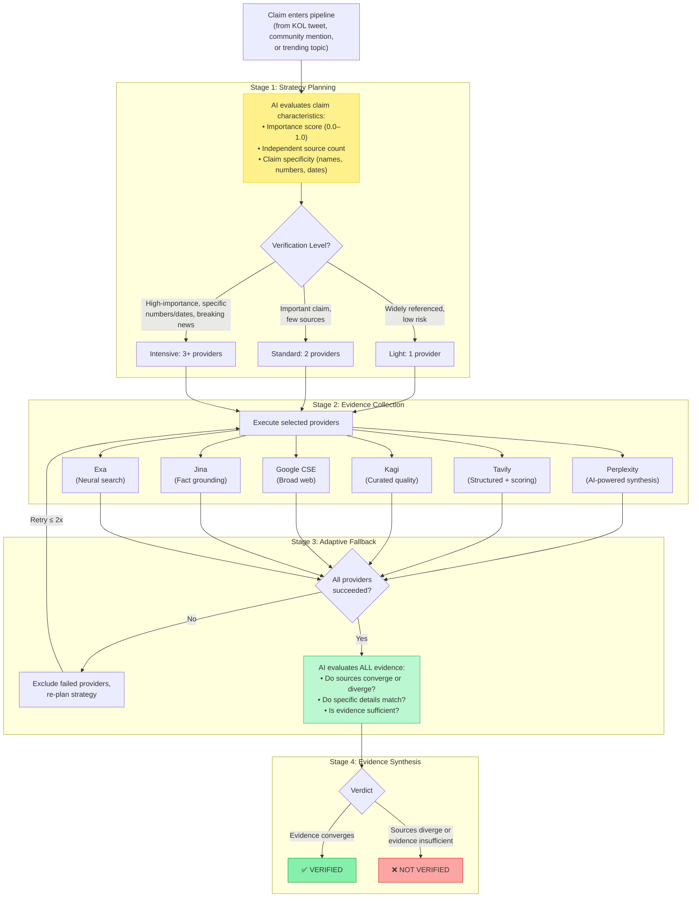
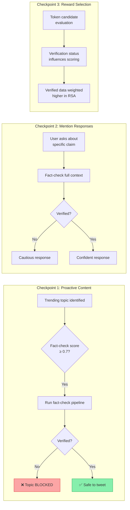
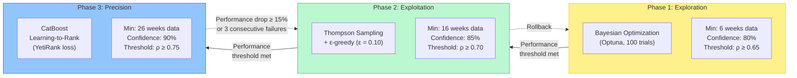
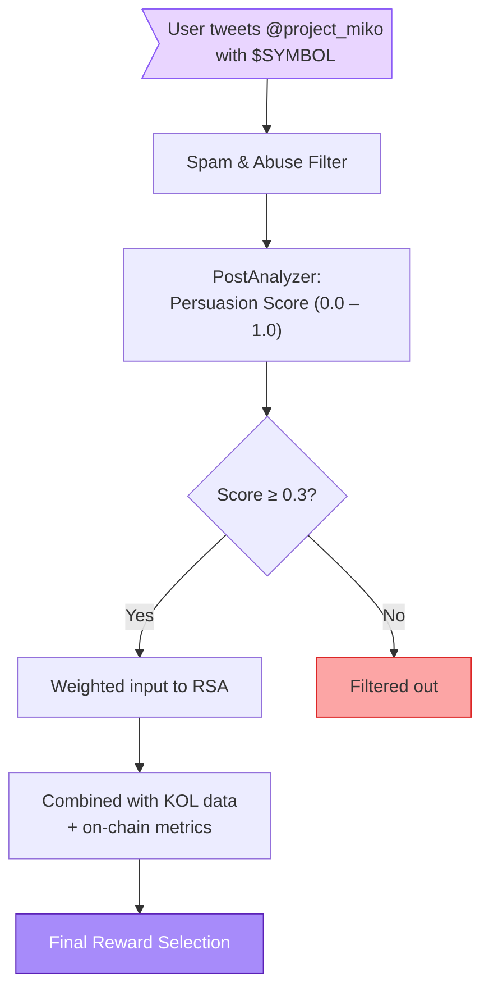
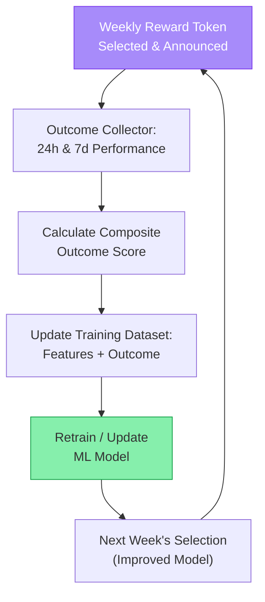

# Technical Architecture: The Intelligence Stack

Miko's intelligence is not a single model responding to prompts. It is a production system composed of specialized layers, each engineered for a specific function in the pipeline from raw data to on-chain execution. This section details each layer — what it does, how it works, and why it matters for holders.

## Architecture Overview

```mermaid
graph TD
    subgraph D["Data Sources"]
        direction LR
        DS1>"KOL Tweets<br/>(400+ monitored)"]
        DS2>"Community Mentions<br/>& Recommendations"]
        DS3>"On-Chain Data<br/>(CoinGecko/Dexscreener/Birdeye API)"]
    end
    subgraph M["Miko AI Agent — Intelligence Stack"]
        direction TB
        L1["Layer 1: Data Ingestion<br/>& Semantic Filtering"]
        L2["Layer 2: Knowledge Graph<br/>& Fact-Checking Engine"]
        L3["Layer 3: Persona-Driven<br/>Generation Core"]
        L4["Layer 4: Reward Selection<br/>Algorithm (RSA)"]
        L1 --> L2
        L2 --> L3
        L2 --> L4
    end
    subgraph X["Execution Layer"]
        direction LR
        X1>"Social Output<br/>(X/Twitter)"]
        X2>"On-Chain Module<br/>(Purchase & Distribute)"]
    end
    DS1 --> L1
    DS2 --> L1
    DS3 --> L1
    L3 --> X1
    L4 --> X2
    style L1 fill:#bfdbfe,stroke:#60a5fa
    style L2 fill:#bfdbfe,stroke:#60a5fa
    style L3 fill:#bfdbfe,stroke:#60a5fa
    style L4 fill:#bfdbfe,stroke:#60a5fa
    style X2 fill:#6ee7b7,stroke:#047857
```

## Layer 1: Data Ingestion and Semantic Filtering

The first layer is the system's sensory apparatus. It connects to the Twitter API and on-chain data sources to collect raw information in real-time.

Raw data is not useful data. This layer applies NLP-based analysis and heuristic rules to:

1.  **Filter noise** — remove irrelevant content (non-crypto, spam, duplicate information)
2.  **Score relevance** — evaluate each data point for uniqueness, community relevance, and potential engagement
3.  **Classify content** — categorize by topic (DeFi, memecoin, infrastructure, etc.) and sentiment (positive, negative, neutral)
4.  **Cluster related discussions** — identify when multiple KOLs are discussing the same topic independently, using HDBSCAN clustering on TF-IDF vectors and embedding similarity

The clustering is critical for the fact-checking pipeline downstream. When three independent KOLs make the same claim, it carries different weight than a single source making a claim that nobody corroborates:

$$
\text{Source Weight}(claim) = \log\left(1 + \frac{n_{\text{distinct\_authors}}}{\alpha}\right) \times \text{avg\_persuasion\_score}
$$

Where $n_{\text{distinct\_authors}}$ is the count of independent sources making the claim and $\alpha = 0.8$ is the power law exponent derived from social media attention distribution (Newman, 2005).

## Layer 2: Knowledge Graph and Multi-Source Fact-Checking Engine

This is the layer that most fundamentally differentiates Miko from other AI agents.

### Knowledge Graph

Miko does not treat each piece of information as isolated. Instead, it integrates data into a structured **Knowledge Graph** stored in PostgreSQL with vector embeddings for semantic search. This graph maps relationships between tokens, KOLs, market events, and projects. When Miko encounters new information about a token, it retrieves all relevant context — past performance, associated KOLs, historical claims, and verification status — enabling informed decisions rather than reactive responses.

The semantic search capability uses cosine similarity on embedding vectors:

$$
\text{relevance}(q, d) = \frac{\vec{q} \cdot \vec{d}}{||\vec{q}|| \times ||\vec{d}||}
$$

Results above the configured importance threshold ($\tau = 0.4$ by default) are surfaced as contextual grounding for both content generation and reward selection.

### The Fact-Checking Pipeline

Most AI agents in the crypto space process LLM output directly — what the model generates is what gets published or acted upon, with no independent verification step. When such agents control financial actions (trading, liquidity provision, token deployment), the cost of unverified information becomes real capital loss.

Miko's Fact-Checking Engine is a four-stage adaptive pipeline that consults **six independent verification providers**:

```mermaid
graph TD
    A["Claim enters pipeline<br/>(from KOL tweet, community mention,<br/>or trending topic)"] --> B

    subgraph "Stage 1: Strategy Planning"
        B["AI evaluates claim characteristics:<br/>• Importance score (0.0–1.0)<br/>• Independent source count<br/>• Claim specificity (names, numbers, dates)"]
        B --> B1{"Verification Level?"}
        B1 -->|"Widely referenced,<br/>low risk"| BL["Light: 1 provider"]
        B1 -->|"Important claim,<br/>few sources"| BS["Standard: 2 providers"]
        B1 -->|"High-importance, specific<br/>numbers/dates, breaking news"| BI["Intensive: 3+ providers"]
    end

    BL --> C
    BS --> C
    BI --> C

    subgraph "Stage 2: Evidence Collection"
        C["Execute selected providers"]
        C --> C1["Perplexity<br/>(AI-powered synthesis)"]
        C --> C2["Tavily<br/>(Structured + scoring)"]
        C --> C3["Kagi<br/>(Curated quality)"]
        C --> C4["Google CSE<br/>(Broad web)"]
        C --> C5["Jina<br/>(Fact grounding)"]
        C --> C6["Exa<br/>(Neural search)"]
    end

    C1 --> D
    C2 --> D
    C3 --> D
    C4 --> D
    C5 --> D
    C6 --> D

    subgraph "Stage 3: Adaptive Fallback"
        D{"All providers<br/>succeeded?"}
        D -->|"No"| E["Exclude failed providers,<br/>re-plan strategy"]
        E -->|"Retry ≤ 2x"| C
        D -->|"Yes"| F
    end

    subgraph "Stage 4: Evidence Synthesis"
        F["AI evaluates ALL evidence:<br/>• Do sources converge or diverge?<br/>• Do specific details match?<br/>• Is evidence sufficient?"]
        F --> G{"Verdict"}
        G -->|"Evidence converges"| H["✅ VERIFIED"]
        G -->|"Sources diverge or<br/>evidence insufficient"| I["❌ NOT VERIFIED"]
    end

    style B fill:#fef08a,stroke:#facc15
    style F fill:#bbf7d0,stroke:#22c55e
    style H fill:#86efac,stroke:#16a34a
    style I fill:#fca5a5,stroke:#dc2626
```

**Key design decisions:**

-   **AI-driven strategy selection:** The verification level is not hardcoded. The AI evaluates each claim's characteristics (specificity, importance, independent source count) and decides *how* to verify it, selecting both the intensity and the specific providers whose strengths match the claim type.
-   **Adaptive fallback:** If a provider fails (API error, timeout), the system excludes it and re-plans the strategy with remaining providers. Up to 2 additional attempts. Temporary outages never block verification.
-   **Evidence convergence requirement:** A claim is verified **only** when evidence from independent sources converges on the same conclusion. Divergent evidence or insufficient data results in a "not verified" verdict.
-   **Specificity-aware evaluation:** The synthesis stage checks whether specific details (names, numbers, dates, amounts) match the evidence, not just the general topic.

### Where Fact-Checking Is Applied

The pipeline operates at three independent checkpoints:

```mermaid
graph LR
    subgraph "Checkpoint 1: Proactive Content"
        A["Trending topic identified"] --> B{"Fact-check score<br/>≥ 0.7?"}
        B -->|"Yes"| C["Run fact-check pipeline"]
        C --> D{"Verified?"}
        D -->|"No"| E["❌ Topic BLOCKED"]
        D -->|"Yes"| F["✅ Safe to tweet"]
    end

    subgraph "Checkpoint 2: Mention Responses"
        H["User asks about<br/>specific claim"] --> I["Fact-check full context"]
        I --> J{"Verified?"}
        J -->|"No"| K["Cautious response"]
        J -->|"Yes"| L["Confident response"]
    end

    subgraph "Checkpoint 3: Reward Selection"
        M["Token candidate<br/>evaluation"] --> N["Verification status<br/>influences scoring"]
        N --> O["Verified data weighted<br/>higher in RSA"]
    end

    style E fill:#fca5a5,stroke:#dc2626
    style F fill:#86efac,stroke:#16a34a
```

**For holders, this means:** Information that feeds into Miko's reward selection has been subjected to multi-source verification. In a market where a single fabricated announcement can move a token's price dramatically, this verification layer is what stands between the holder's weekly reward and a selection based on false information.

## Layer 3: Persona-Driven Generation Core

This layer creates Miko's voice — the public-facing content on X (Twitter) that drives community engagement and growth.

The Generation Core runs on a multi-model architecture (Gemini and Claude) with automatic failover. If the primary model experiences rate limiting or downtime, the system seamlessly switches to the fallback provider, ensuring continuous operation.

Multiple **reaction modes** allow Miko to respond dynamically to different situations — from cheerful curiosity for friendly exchanges to sharp wit for provocative interactions to analytical depth for market discussions. These modes are not random; the system evaluates the conversational context and selects the most appropriate response style.

Every response Miko generates is verified for originality before posting. The system ensures content is genuinely Miko's own expression, not a mechanical repetition of source material. This is enforced through multiple independent verification layers at the code level.

**For holders, this matters because:** Miko's social presence is the primary driver of community growth. Community growth drives trading volume. Trading volume generates tax revenue. Tax revenue funds rewards. The quality and authenticity of Miko's social output directly impacts the size of the weekly reward pool.

## Layer 4: Reward Selection Algorithm (RSA)

This is the financial brain of the protocol — the system that determines which token holders will receive each week. It is the most critical component for holder value and the most technically sophisticated.

### Three-Phase ML Evolution

The RSA evolves through three distinct statistical phases, each requiring more data and delivering higher precision. Phase transitions are automatic (based on statistical significance thresholds) and reversible (automatic rollback on performance degradation).

```mermaid
graph LR
    subgraph P1["Phase 1: Exploration"]
        P1A["Bayesian Optimization<br/>(Optuna, 100 trials)"]
        P1B["Min: 6 weeks data<br/>Confidence: 80%<br/>Threshold: ρ ≥ 0.65"]
    end
    subgraph P2["Phase 2: Exploitation"]
        P2A["Thompson Sampling<br/>+ ε-greedy (ε = 0.10)"]
        P2B["Min: 16 weeks data<br/>Confidence: 85%<br/>Threshold: ρ ≥ 0.70"]
    end
    subgraph P3["Phase 3: Precision"]
        P3A["CatBoost<br/>Learning-to-Rank<br/>(YetiRank loss)"]
        P3B["Min: 26 weeks data<br/>Confidence: 90%<br/>Threshold: ρ ≥ 0.75"]
    end
    P1 -->|"Performance<br/>threshold met"| P2
    P2 -->|"Performance<br/>threshold met"| P3
    P3 -.->|"Performance drop ≥ 15%<br/>or 3 consecutive failures"| P2
    P2 -.->|"Rollback"| P1
    style P1 fill:#fef08a,stroke:#facc15
    style P2 fill:#bbf7d0,stroke:#22c55e
    style P3 fill:#93c5fd,stroke:#2563eb
```

**Phase 1 — Bayesian Optimization:** With limited historical data (first 6+ weeks), the system uses Bayesian optimization via Optuna to explore which features and weight combinations best predict successful token selections. This phase is exploratory — the model is learning what matters.

**Phase 2 — Thompson Sampling:** With 16+ weeks of accumulated data, the system transitions to Thompson Sampling with 10% epsilon-greedy exploration. This balances exploiting known successful patterns with continued exploration of new opportunities. The transition requires a Spearman correlation coefficient $\rho \geq 0.7$ between predicted and actual outcomes.

**Phase 3 — CatBoost Learning-to-Rank:** With 26+ weeks of data, a full machine learning model using CatBoost's YetiRank loss function takes over. This model predicts which candidate token will achieve the highest Composite Outcome Score.

### Composite Outcome Score

Each selection is evaluated against a multi-metric composite score. The weights are derived from empirical research on cryptocurrency success factors:

$$
S_{\text{composite}} = \sum_{i=1}^{n} w_i \cdot x_i
$$

| Metric ($x_i$) | Weight ($w_i$) | Research Basis |
| :--- | :---: | :--- |
| Reward token price performance | 0.40 | Chen et al. (2023): 45-55% range midpoint |
| $MIKO holder growth rate | 0.22 | Liu & Tsyvinski (2021): network effects |
| $MIKO token price performance | 0.20 | Eisenmann et al. (2006): indirect effects ≈ 50% of direct |
| Community sentiment | 0.10 | Kraaijeveld & De Smedt (2020): 8-12% range |
| Tweet engagement | 0.05 | DeFi Alliance (2024): indirect indicator |
| $MIKO volume growth | 0.03 | Brandvold et al. (2015): 3-7% range lower bound |

$$
\sum_{i=1}^{6} w_i = 1.00
$$

### Automatic Rollback Mechanism

The system includes hard-coded safeguards against model degradation:

$$
\text{Rollback triggers if:} \begin{cases}
\Delta_{\text{performance}} \geq 0.15 & \text{(15\% drop from baseline)} \\
n_{\text{consecutive\_failures}} \geq 3 & \text{(3 sequential underperformances)} \\
\Delta_{\text{confidence}} \geq 0.10 & \text{(10\% confidence degradation)}
\end{cases}
$$

When triggered, the system reverts to the previous phase and continues collecting data until the transition threshold is met again. This ensures that a poorly calibrated model never persists in making selections with real capital.

### Token Quality Filters

Before any token can be considered as a reward candidate, it must pass a two-tier quality assessment.

**Tier 1: Hard Threshold Filters**

| Filter | Threshold | Rationale |
| :--- | :--- | :--- |
| Minimum Market Cap | $3,000,000 | Below this, manipulation risk is elevated (Kaiko Research, 2025) |
| Minimum 24h Volume | $1,000,000 | Ensures sufficient liquidity for purchase execution |
| Excluded Tokens | $MIKO | Prevents conflict-of-interest in self-selection |
| Exempt Tokens | $SOL | Native asset exempted from quality filters |

**Tier 2: DEX Market Structure Assessment**

Candidates that pass the hard filters are then evaluated through a multi-factor market structure analysis using real-time DEX data. This assessment produces a market bonus score that incorporates:

-   **Order flow analysis:** Buy/sell pressure ratio — measures whether a token is under net accumulation or distribution
-   **Transaction velocity:** Rate of on-chain transactions — accelerating velocity suggests growing organic interest
-   **Breakout readiness:** Technical positioning relative to recent price range — identifies tokens at potential inflection points
-   **Relative strength:** Performance relative to the broader Solana market — filters for tokens showing independent momentum
-   **Holder breadth:** Distribution of token holders — wider distribution suggests healthier, less manipulable markets

**Risk-Based Safety Penalties:**

The market bonus is subject to multiplicative safety penalties:
-   **Severe risk flags** (e.g., concentrated ownership, suspicious contract patterns) → 75% penalty
-   **Fast decay detection** (rapid price decline pattern) → 50% penalty
-   **Elevated risk score** → proportional discount based on severity

This two-tier system ensures that reward tokens are not only above minimum quality thresholds, but are also evaluated for market health and manipulation risk before being considered by the ML selection algorithm.

### Community Suggestions and Persuasion Analysis

Community members can recommend tokens by mentioning Miko (`@project_miko`) with a `$SYMBOL` tag. Unlike simple vote-counting systems, each recommendation is evaluated by the PostAnalyzer's persuasion scoring:

$$
\text{persuasion\_score}(tweet) = f(\text{authenticity}, \text{reasoning\_depth}, \text{community\_alignment}, \text{ecosystem\_relevance})
$$

```mermaid
graph TD
    A>"User tweets @project_miko<br/>with $SYMBOL"] --> B["Spam & Abuse Filter"]
    B --> C["PostAnalyzer:<br/>Persuasion Score (0.0 – 1.0)"]
    C --> D{"Score ≥ 0.3?"}
    D -->|"Yes"| E["Weighted input to RSA"]
    D -->|"No"| F["Filtered out"]
    E --> G["Combined with KOL data<br/>+ on-chain metrics"]
    G --> H["Final Reward Selection"]
    style A fill:#E9D5FF,stroke:#8B5CF6
    style F fill:#fca5a5,stroke:#dc2626
    style H fill:#A78BFA,stroke:#5B21B6,color:#fff
```

Spamming the same $SYMBOL repeatedly is ineffective — the minimum persuasion threshold of 0.3 (lower 30th percentile cutoff) and the minimum of 3 total mentions ensure that only reasoned, authentic community input influences the selection.

### The Self-Improvement Loop

Every selection generates outcome data that feeds back into the model:

```mermaid
graph TD
    A["Weekly Reward Token<br/>Selected & Announced"] --> B["Outcome Collector:<br/>24h & 7d Performance"]
    B --> C["Calculate Composite<br/>Outcome Score"]
    C --> D["Update Training Dataset:<br/>Features + Outcome"]
    D --> E["Retrain / Update<br/>ML Model"]
    E --> F["Next Week's Selection<br/>(Improved Model)"]
    F --> A
    style A fill:#a78bfa,stroke:#7c3aed,color:#fff
    style E fill:#86efac,stroke:#16a34a
```

This creates a closed-loop system where the AI's selections become progressively more refined over time. Early selections (Phase 1) are exploratory; later selections (Phase 3) are informed by months of accumulated outcome data and a fully trained ranking model.

## Verifiable Track Record

Most AI agent projects ask holders to trust their intelligence based on narrative — follower counts, ecosystem metrics, or team credentials. MIKO's system is designed to be **measurable by default**.

Every reward selection is automatically recorded with its full context: the token selected, the ML phase and model version that made the decision, whether it was an exploration pick, and — critically — the selected token's price performance at 24 hours and 7 days after announcement. Each selection receives a Composite Outcome Score that quantifies its success, and this score feeds directly back into the ML model's training data.

Phase transitions and rollbacks are logged with their trigger metrics, creating a complete, queryable history of how the AI's decision-making has evolved over time.

This means MIKO's AI does not simply claim to be intelligent — it accumulates a track record that can be audited against objective outcomes. The Reward Hall of Fame and MIKO's Insight Dashboard will make this data publicly accessible, allowing holders and prospective investors to evaluate the AI's performance for themselves rather than taking it on trust.
