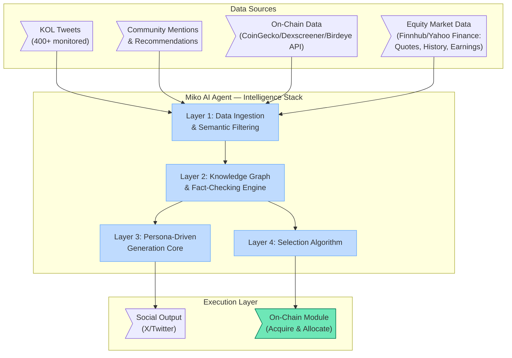
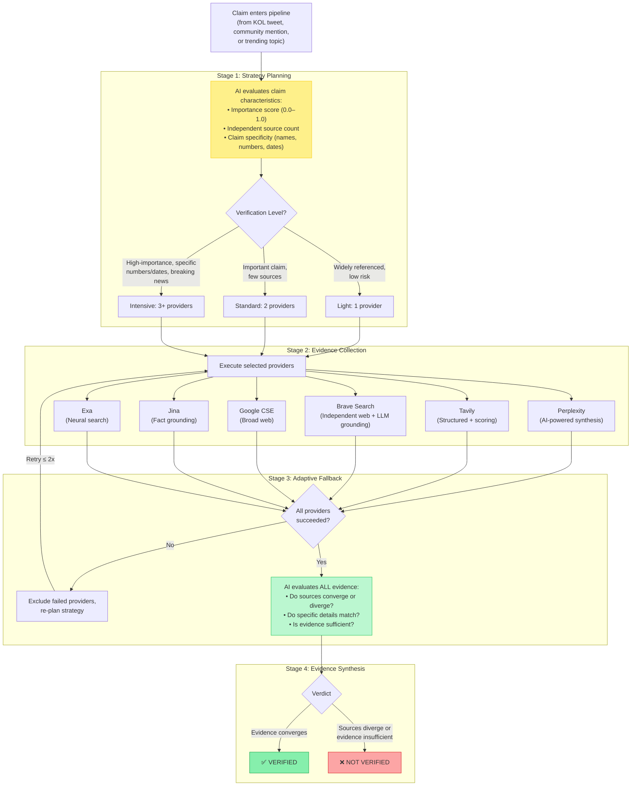
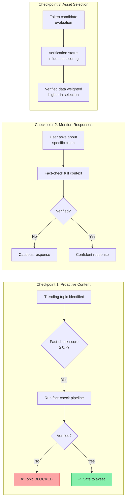
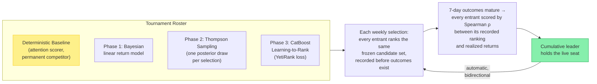
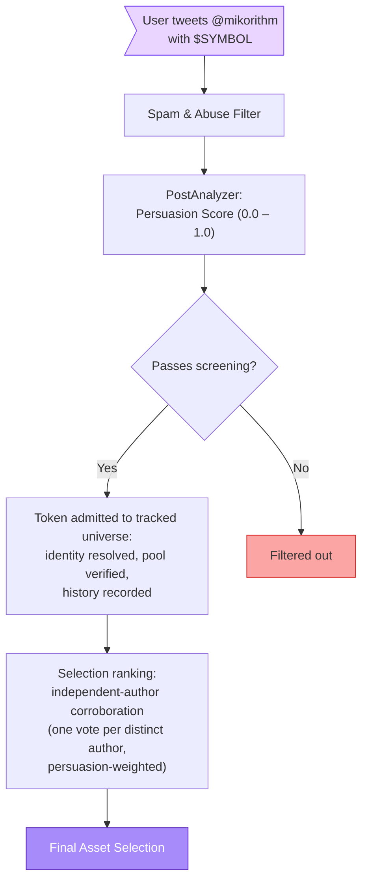
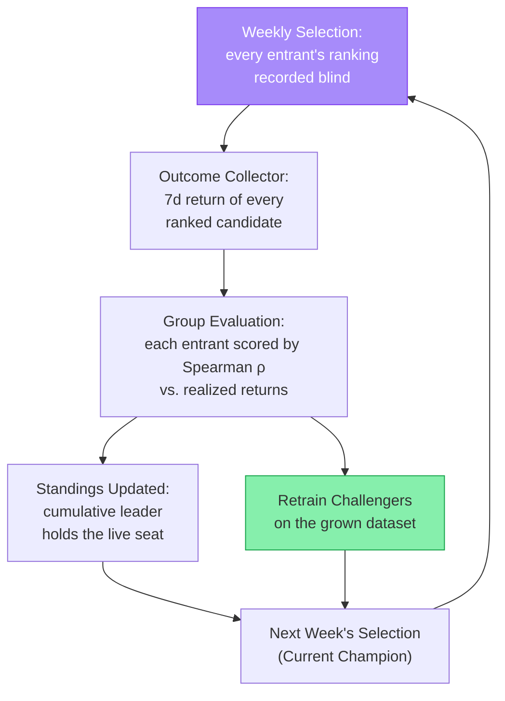

# Technical Architecture: The Intelligence Stack

Miko's intelligence is not a single model responding to prompts. It is a production system composed of specialized layers, each engineered for a specific function in the pipeline from raw data to on-chain execution. This section details each layer — what it does, how it works, and why it matters for holders.

## Architecture Overview

```mermaid
graph TD
    subgraph D["Data Sources"]
        direction LR
        DS1>"KOL Tweets<br/>(400+ monitored)"]
        DS2>"Community Mentions<br/>& Recommendations"]
        DS3>"On-Chain Data<br/>(CoinGecko/Dexscreener/Birdeye API)"]
        DS4>"Equity Market Data<br/>(Finnhub/Yahoo Finance:<br/>Quotes, History, Earnings)"]
    end
    subgraph M["Miko AI Agent — Intelligence Stack"]
        direction TB
        L1["Layer 1: Data Ingestion<br/>& Semantic Filtering"]
        L2["Layer 2: Knowledge Graph<br/>& Fact-Checking Engine"]
        L3["Layer 3: Persona-Driven<br/>Generation Core"]
        L4["Layer 4: Selection Algorithm"]
        L1 --> L2
        L2 --> L3
        L2 --> L4
    end
    subgraph X["Execution Layer"]
        direction LR
        X1>"Social Output<br/>(X/Twitter)"]
        X2>"On-Chain Module<br/>(Acquire & Allocate)"]
    end
    DS1 --> L1
    DS2 --> L1
    DS3 --> L1
    DS4 --> L1
    L3 --> X1
    L4 --> X2
    style L1 fill:#bfdbfe,stroke:#60a5fa
    style L2 fill:#bfdbfe,stroke:#60a5fa
    style L3 fill:#bfdbfe,stroke:#60a5fa
    style L4 fill:#bfdbfe,stroke:#60a5fa
    style X2 fill:#6ee7b7,stroke:#047857
```

## Layer 1: Data Ingestion and Semantic Filtering

The first layer is the system's sensory apparatus. It connects to the Twitter API, on-chain data sources, and — for the chain's tokenized equities — traditional equity market data feeds (Finnhub and Yahoo Finance) to collect raw information in real-time.

Raw data is not useful data. This layer applies NLP-based analysis and heuristic rules to:

1.  **Filter noise** — remove irrelevant content (non-crypto, spam, duplicate information)
2.  **Score relevance** — evaluate each data point for uniqueness, community relevance, and potential engagement
3.  **Classify content** — categorize by topic (DeFi, memecoin, infrastructure, etc.) and sentiment (positive, negative, neutral)
4.  **Cluster related discussions** — identify when multiple KOLs are discussing the same topic independently, using HDBSCAN clustering on TF-IDF vectors and embedding similarity

The clustering is critical for the fact-checking pipeline downstream. When three independent KOLs make the same claim, it carries different weight than a single source making a claim that nobody corroborates:

$$
\text{Source Weight}(claim) = \log\left(1 + \frac{n_{\text{distinct\_authors}}}{\alpha}\right) \times \text{avg\_persuasion\_score}
$$

Where $n_{\text{distinct\_authors}}$ is the count of independent sources making the claim and $\alpha = 0.8$ is the power law exponent derived from social media attention distribution (Newman, 2005).

## Layer 2: Knowledge Graph and Multi-Source Fact-Checking Engine

This is the layer that most fundamentally differentiates Miko from other AI agents.

### Knowledge Graph

Miko does not treat each piece of information as isolated. Instead, it integrates data into a structured **Knowledge Graph** stored in proprietary database with vector embeddings for semantic search. This graph maps relationships between tokens, KOLs, market events, and projects. When Miko encounters new information about a token, it retrieves all relevant context — past performance, associated KOLs, historical claims, and verification status — enabling informed decisions rather than reactive responses.

The semantic search capability uses cosine similarity on embedding vectors:

$$
\text{relevance}(q, d) = \frac{\vec{q} \cdot \vec{d}}{||\vec{q}|| \times ||\vec{d}||}
$$

Results above the configured importance threshold ($\tau = 0.4$ by default) are surfaced as contextual grounding for both content generation and asset selection.

### The Fact-Checking Pipeline

Most AI agents in the crypto space process LLM output directly — what the model generates is what gets published or acted upon, with no independent verification step. When such agents control financial actions (trading, liquidity provision, token deployment), the cost of unverified information becomes real capital loss.

Miko's Fact-Checking Engine is a four-stage adaptive pipeline that consults **six independent verification providers**:

```mermaid
graph TD
    A["Claim enters pipeline<br/>(from KOL tweet, community mention,<br/>or trending topic)"] --> B

    subgraph "Stage 1: Strategy Planning"
        B["AI evaluates claim characteristics:<br/>• Importance score (0.0–1.0)<br/>• Independent source count<br/>• Claim specificity (names, numbers, dates)"]
        B --> B1{"Verification Level?"}
        B1 -->|"Widely referenced,<br/>low risk"| BL["Light: 1 provider"]
        B1 -->|"Important claim,<br/>few sources"| BS["Standard: 2 providers"]
        B1 -->|"High-importance, specific<br/>numbers/dates, breaking news"| BI["Intensive: 3+ providers"]
    end

    BL --> C
    BS --> C
    BI --> C

    subgraph "Stage 2: Evidence Collection"
        C["Execute selected providers"]
        C --> C1["Perplexity<br/>(AI-powered synthesis)"]
        C --> C2["Tavily<br/>(Structured + scoring)"]
        C --> C3["Brave Search<br/>(Independent web + LLM grounding)"]
        C --> C4["Google CSE<br/>(Broad web)"]
        C --> C5["Jina<br/>(Fact grounding)"]
        C --> C6["Exa<br/>(Neural search)"]
    end

    C1 --> D
    C2 --> D
    C3 --> D
    C4 --> D
    C5 --> D
    C6 --> D

    subgraph "Stage 3: Adaptive Fallback"
        D{"All providers<br/>succeeded?"}
        D -->|"No"| E["Exclude failed providers,<br/>re-plan strategy"]
        E -->|"Retry ≤ 2x"| C
        D -->|"Yes"| F
    end

    subgraph "Stage 4: Evidence Synthesis"
        F["AI evaluates ALL evidence:<br/>• Do sources converge or diverge?<br/>• Do specific details match?<br/>• Is evidence sufficient?"]
        F --> G{"Verdict"}
        G -->|"Evidence converges"| H["✅ VERIFIED"]
        G -->|"Sources diverge or<br/>evidence insufficient"| I["❌ NOT VERIFIED"]
    end

    style B fill:#fef08a,stroke:#facc15
    style F fill:#bbf7d0,stroke:#22c55e
    style H fill:#86efac,stroke:#16a34a
    style I fill:#fca5a5,stroke:#dc2626
```

**Key design decisions:**

-   **AI-driven strategy selection:** The verification level is not hardcoded. The AI evaluates each claim's characteristics (specificity, importance, independent source count) and decides *how* to verify it, selecting both the intensity and the specific providers whose strengths match the claim type.
-   **Adaptive fallback:** If a provider fails (API error, timeout), the system excludes it and re-plans the strategy with remaining providers. Up to 2 additional attempts. Temporary outages never block verification.
-   **Evidence convergence requirement:** A claim is verified **only** when evidence from independent sources converges on the same conclusion. Divergent evidence or insufficient data results in a "not verified" verdict.
-   **Specificity-aware evaluation:** The synthesis stage checks whether specific details (names, numbers, dates, amounts) match the evidence, not just the general topic.

### Where Fact-Checking Is Applied

The pipeline operates at three independent checkpoints:

```mermaid
graph LR
    subgraph "Checkpoint 1: Proactive Content"
        A["Trending topic identified"] --> B{"Fact-check score<br/>≥ 0.7?"}
        B -->|"Yes"| C["Run fact-check pipeline"]
        C --> D{"Verified?"}
        D -->|"No"| E["❌ Topic BLOCKED"]
        D -->|"Yes"| F["✅ Safe to tweet"]
    end

    subgraph "Checkpoint 2: Mention Responses"
        H["User asks about<br/>specific claim"] --> I["Fact-check full context"]
        I --> J{"Verified?"}
        J -->|"No"| K["Cautious response"]
        J -->|"Yes"| L["Confident response"]
    end

    subgraph "Checkpoint 3: Asset Selection"
        M["Token candidate<br/>evaluation"] --> N["Verification status<br/>influences scoring"]
        N --> O["Verified data weighted<br/>higher in selection"]
    end

    style E fill:#fca5a5,stroke:#dc2626
    style F fill:#86efac,stroke:#16a34a
```

**For holders, this means:** Information that feeds into Miko's asset selection has been subjected to multi-source verification. In a market where a single fabricated announcement can move a token's price dramatically, this verification layer is what stands between the holder's allocation and a selection based on false information.

## Layer 3: Persona-Driven Generation Core

This layer creates Miko's voice: the public-facing content on X (Twitter) that drives community engagement and growth.

Multiple **reaction modes** allow Miko to respond dynamically to different situations — from cheerful curiosity for friendly exchanges to sharp wit for provocative interactions to analytical depth for market discussions. These modes are not random; the system evaluates the conversational context and selects the most appropriate response style.

Beyond conversational content, the Generation Core publishes **structured market reads**: when a token takes over the top of MIKO's attention board, Miko posts a curator's read — what is actually carrying the move, what kind of table it is, and the specific on-chain meter that decides where it goes next. These reads are grounded in the analyst layer's measured facts (including observed holder-structure data) and always end on the watch-point, never on a verdict — Miko is a curator, not a trading-signal account.

Every response Miko generates is verified for originality before posting. The system ensures content is genuinely Miko's own expression, not a mechanical repetition of source material. This is enforced through multiple independent verification layers at the code level.

Miko's persona is also **published as an open model**: a fine-tuned open-weights release on Hugging Face and Ollama that carries her voice in the weights themselves, callable through the live REST API and MCP server. See [Open Model](built-with-miko/open-model).

**For holders, this matters because:** Miko's social presence is the primary driver of community growth. Community growth drives trading volume. Trading volume generates tax revenue. Tax revenue funds the weekly acquisitions. The quality and authenticity of Miko's social output directly impacts the size of the weekly acquisition treasury.

## Layer 4: Selection Algorithm

This is the financial brain of the protocol. It runs **two decision streams** — the weekly core selection that determines what the core sleeve buys, and the continuous attention-leader tracking that steers the satellite sleeve. It is the most critical component for holder allocations and the most technically sophisticated.

### The Model Tournament: Three Phases, One Live Seat

The Selection Algorithm is built as a live tournament between competing models. Three statistical phases — each a real model family requiring progressively more data — enter the tournament as training data accumulates, and the weekly core selection is always made by the current champion.

```mermaid
graph LR
    subgraph R["Tournament Roster"]
        R0["Deterministic Baseline<br/>(attention scorer,<br/>permanent competitor)"]
        R1["Phase 1: Bayesian<br/>linear return model"]
        R2["Phase 2: Thompson Sampling<br/>(one posterior draw<br/>per selection)"]
        R3["Phase 3: CatBoost<br/>Learning-to-Rank<br/>(YetiRank loss)"]
    end
    R --> S["Each weekly selection:<br/>every entrant ranks the same<br/>frozen candidate set,<br/>recorded before outcomes exist"]
    S --> E["7-day outcomes mature →<br/>every entrant scored by Spearman ρ<br/>between its recorded ranking<br/>and realized returns"]
    E --> C["Cumulative leader<br/>holds the live seat"]
    C -->|"automatic,<br/>bidirectional"| S
    style R0 fill:#fef08a,stroke:#facc15
    style C fill:#86efac,stroke:#16a34a
```

How the seat is decided:

-   **Blind predictions first.** At each weekly selection, every entrant scores the same frozen candidate view, and its complete ranking is recorded before any outcome exists. Predictions are immutable — there is no backscoring.
-   **Outcomes as the judge.** When a selection group's 7-day outcomes are complete, each entrant is scored by the Spearman rank correlation between its recorded ranking and the candidates' realized 7-day returns — every entrant against the identical candidate set and identical labels.
-   **The champion is the cumulative leader.** The live selector is whichever entrant leads the accumulated paired record. Promotion and demotion are the same rule in both directions: a model takes the seat by out-predicting the incumbent on the shared record, and loses it the same way. Both directions are automatic.
-   **Sequential entry.** Phase 1 — a Bayesian linear return model fitted over the frozen candidate features, with its prior anchored to the deterministic baseline — enters as soon as the first complete training group exists. Phase 2 — Thompson sampling that draws one reproducible coefficient sample from the Phase 1 posterior per selection and scores all candidates with that same draw — follows. Phase 3 — CatBoost learning-to-rank with YetiRank loss, one ranking group per selection — enters as the dataset grows. Each new entrant competes from its first week: it is scored, not trusted.
-   **The permanent baseline.** The deterministic attention scorer anchoring the roster is never retired. If no learned model can out-predict it, it simply keeps the seat — a floor under the whole system. Random selection and the chain's benchmark asset are recorded alongside the roster as reference floors, visible in the same records but never eligible for the seat.

### The Deterministic Baseline: Attention Acceleration

The tournament's founding incumbent is a deterministic scorer built for one question: *where is verified, independent attention arriving right now?*

-   **Independent-author corroboration:** selection input is KOL coverage with **one vote per distinct author** — an author's repeated posts collapse into a single voice, so posting volume cannot substitute for breadth. A minimum number of independent authors in the current window is required before a token is rankable at all.
-   **Persuasion-weighted support:** each author's voice is weighted by the persuasion score of their posts, so reasoned conviction counts more than reflexive hype, and low-persuasion noise shrinks toward zero.
-   **Acceleration, not level:** support is measured against the token's own trailing 7-day baseline. A token that has been loud all week must keep exceeding its own normal to stay on top; a quiet token that suddenly draws broad, persuasive attention registers immediately.

### Outcome Measurement

Two layers of outcome data are recorded for every weekly cycle.

**Training labels.** The learning models train on — and are judged by — the realized 7-day return of **every candidate** in the frozen selection group, not only the announced winner. All-candidate labels are what make rank correlation measurable: the system records not just how its pick performed, but how everything it ranked performed.

**The public track record.** Each announced selection additionally receives a multi-metric composite score for the public track record. The weights are derived from empirical research on cryptocurrency success factors:

$$
S_{\text{composite}} = \sum_{i=1}^{n} w_i \cdot x_i
$$

| Metric ($x_i$) | Weight ($w_i$) | Research Basis |
| :--- | :---: | :--- |
| Selected asset price performance | 0.40 | Chen et al. (2023): 45-55% range midpoint |
| \$MIKO holder growth rate | 0.22 | Liu & Tsyvinski (2021): network effects |
| \$MIKO token price performance | 0.20 | Eisenmann et al. (2006): indirect effects ≈ 50% of direct |
| Community sentiment | 0.10 | Kraaijeveld & De Smedt (2020): 8-12% range |
| Tweet engagement | 0.05 | DeFi Alliance (2024): indirect indicator |
| \$MIKO volume growth | 0.03 | Brandvold et al. (2015): 3-7% range lower bound |

$$
\sum_{i=1}^{6} w_i = 1.00
$$

### Champion Accountability

Degradation protection is built into the seat itself rather than bolted on as a separate mechanism. The champion is re-derived from the cumulative record every time a selection group's outcomes mature: a model that stops out-predicting its competitors loses the live seat to whichever entrant now leads — including back to the deterministic baseline. Because demotion is the same automatic rule as promotion, a poorly calibrated model cannot persist in making selections with real capital, and every seat change is recorded with the standings that caused it.

### Token Quality Filters

Before any token can be considered as a selection candidate, it must pass a two-tier quality assessment.

**Tier 1: Hard Threshold Filters**

| Filter | Threshold | Rationale |
| :--- | :--- | :--- |
| Minimum Market Cap | \$2,000,000 | Below this, manipulation risk is elevated (Kaiko Research, 2025; calibrated to Robinhood Chain market scale) |
| Minimum 24h Volume | \$500,000 | Ensures sufficient liquidity for purchase execution |
| Excluded Tokens | \$MIKO | Prevents conflict-of-interest in self-selection |
| Exempt Tokens | \$WETH | Benchmark asset exempted from quality filters |

**Tier 2: DEX Market Structure Assessment**

Candidates that pass the hard filters are then screened through a multi-factor market structure analysis using real-time DEX data. The assessment is a safety screen: structural red flags veto a candidate for that cycle rather than adjusting its score. Signals evaluated include:

-   **Order flow analysis:** Buy/sell pressure ratio — measures whether a token is under net accumulation or distribution
-   **Transaction velocity:** Rate of on-chain transactions — accelerating velocity suggests growing organic interest
-   **Breakout readiness:** Technical positioning relative to recent price range — identifies tokens at potential inflection points
-   **Relative strength:** Performance relative to the broader Robinhood Chain market — filters for tokens showing independent momentum
-   **Holder breadth:** Distribution of token holders — wider distribution suggests healthier, less manipulable markets

**Structural Vetoes:**

Severe risk flags — concentrated ownership, one-way order flow, thin exit liquidity — remove a candidate from consideration for that cycle outright, regardless of how strongly the attention scoring favors it.

This two-tier system ensures that candidate assets both clear minimum quality thresholds and pass a market-health and manipulation-risk screen before any selection is finalized.

### Equity Market Context for Stock-Token Candidates

Robinhood Chain's tokenized equities are not evaluated with crypto metrics alone — a stock token's on-chain price is a window onto a real company trading in a real market, and MIKO reads that market natively through a dedicated equity data pipeline:

| Signal | Source | What it tells the model |
| :--- | :--- | :--- |
| Real-time quote & day move | Finnhub | Where the underlying equity is trading right now |
| Week / month price history, multi-window trend | Yahoo Finance | Whether a move is a day event or a developing trend |
| 52-week range position (0–100) | Yahoo Finance | Whether attention is arriving near highs, lows, or mid-range |
| Volume anomaly vs. prior-20-session average | Yahoo Finance | Whether the underlying market itself is unusually active |
| Earnings calendar & proximity flags | Finnhub | Whether a known scheduled catalyst is days away |
| Nominal NY trading session | Schedule-derived | Whether the underlying market is open, closed, or pre/post — so a flat on-chain price during a closed session is never misread as apathy |

Two further layers calibrate these signals to this chain:

-   **Chain-local size calibration:** "large" and "small" are defined by the measured size distribution of the chain's own tracked equity universe — liquidity, market cap, and volume quantiles computed from live data — not by legacy-market intuitions imported from elsewhere.
-   **Prior-evaluation loop:** every published stock read is stored and later scored against the equity's subsequent market data on a fixed cadence, so the system's equity judgments accumulate the same measurable track record as its crypto selections.

This is what "reading both engines of the chain" means in practice: community tokens are read through on-chain flow and social verification, and tokenized equities are read through the actual equity market they mirror.

### Community Suggestions and Persuasion Analysis

Community members can put a token on Miko's radar by mentioning her (`@mikorithm`) with a `$SYMBOL` tag. Every recommendation is read and evaluated — the PostAnalyzer scores its persuasiveness from Miko's own perspective:

$$
\text{persuasion\_score}(tweet) = f(\text{authenticity}, \text{reasoning\_depth}, \text{community\_alignment}, \text{ecosystem\_relevance})
$$

A recommendation that clears the spam filter and the persuasion screen **admits the token into Miko's tracked candidate universe**: its on-chain identity is resolved, its pool is verified, and from that point its attention and market history are recorded continuously. Discovery is where community input carries real power — a token that no one on the KOL radar has named yet can enter Miko's field of view through a single well-argued mention.

Selection weight, however, is earned through independent corroboration: the ranking that decides the weekly asset counts one vote per distinct author on the KOL radar, persuasion-weighted and measured against the token's own baseline. Spamming a \$SYMBOL is ineffective by construction — repeated posts from one account collapse into a single voice, and no volume of self-promotion can substitute for broad, independent conviction.

```mermaid
graph TD
    A>"User tweets @mikorithm<br/>with $SYMBOL"] --> B["Spam & Abuse Filter"]
    B --> C["PostAnalyzer:<br/>Persuasion Score (0.0 – 1.0)"]
    C --> D{"Passes screening?"}
    D -->|"Yes"| E["Token admitted to tracked universe:<br/>identity resolved, pool verified,<br/>history recorded"]
    D -->|"No"| F["Filtered out"]
    E --> G["Selection ranking:<br/>independent-author corroboration<br/>(one vote per distinct author,<br/>persuasion-weighted)"]
    G --> H["Final Asset Selection"]
    style A fill:#E9D5FF,stroke:#8B5CF6
    style F fill:#fca5a5,stroke:#dc2626
    style H fill:#A78BFA,stroke:#5B21B6,color:#fff
```

### The Satellite Stream: Gated Attention Tracking

The satellite sleeve's decision stream runs continuously rather than weekly. MIKO's attention board ranks community tokens in real time using the deterministic attention-acceleration scorer directly — author-deduplicated, persuasion-weighted KOL support measured against each token's own baseline — and the board's leader is the satellite's target. The satellite always runs on this deterministic instrument: fast rotation stays on the scorer purpose-built for freshness, while the learned models compete for the weekly core seat. A leader change does not rotate the sleeve by itself — the rotation must first pass **evidence-based veto gates**:

-   **Spike discipline:** a candidate whose day combines an outsized price move with abnormal volume (both thresholds measured, not guessed — they were selected from an out-of-sample backtest across 404 tokens and 64 candidate rules, of which only this pattern showed consistent directional evidence) is vetoed for that day. The gate exists because such days statistically precede underperformance — the rotation waits rather than buys the hangover.
-   **Structural safety vetoes:** minimum market cap, DEX market-structure risk flags, and a re-entry cooldown that prevents rotating back into a token the sleeve just exited.

The attention board's reads are further enriched with **observed holder-structure data** from public, parameterized on-chain queries (Dune Analytics): what share of a token's recent buyers are first-time entrants within the scan window, what share of earlier buyers have not sold, and how concentrated the buying is — measured DEX activity only, never inferred "holding" claims.

A vetoed rotation is deferred, never forced: the sleeve simply keeps its current position until a candidate passes. Every gate verdict is recorded with its full input signals, making the satellite's behavior as auditable as the weekly selection's.

### The Self-Improvement Loop

Every weekly cycle generates outcome data that feeds back into the models:

```mermaid
graph TD
    A["Weekly Selection:<br/>every entrant's ranking<br/>recorded blind"] --> B["Outcome Collector:<br/>7d return of every<br/>ranked candidate"]
    B --> C["Group Evaluation:<br/>each entrant scored by Spearman ρ<br/>vs. realized returns"]
    C --> D["Standings Updated:<br/>cumulative leader<br/>holds the live seat"]
    C --> E["Retrain Challengers<br/>on the grown dataset"]
    D --> F["Next Week's Selection<br/>(Current Champion)"]
    E --> F
    F --> A
    style A fill:#a78bfa,stroke:#7c3aed,color:#fff
    style E fill:#86efac,stroke:#16a34a
```

This creates a closed-loop system where the selection intelligence becomes progressively more refined: every completed week adds one more fully scored group to the shared record, the learning models retrain on the grown dataset, and the live seat follows the accumulated evidence.

## Verifiable Track Record

Most AI agent projects ask holders to trust their intelligence based on narrative — follower counts, ecosystem metrics, or team credentials. MIKO's system is designed to be **measurable by default**.

Every asset selection is automatically recorded with its full context: the asset selected, the exact tournament entrant and model artifact that made the decision, every entrant's blind ranking of the full candidate set, and — critically — the realized price performance of every ranked candidate at 24 hours and 7 days after announcement. Each announced selection receives a Composite Outcome Score for the public record, while the all-candidate outcomes feed the models' training data.

Champion changes and each cycle's tournament standings are logged with the record that produced them, creating a complete, queryable history of how the AI's decision-making has evolved over time.

This means MIKO's AI's intelligence is grounded in an auditable track record against objective outcomes. The Selection Track Record and MIKO's Insight Dashboard make this data publicly accessible, allowing holders and prospective investors to evaluate the AI's performance directly from the data.
