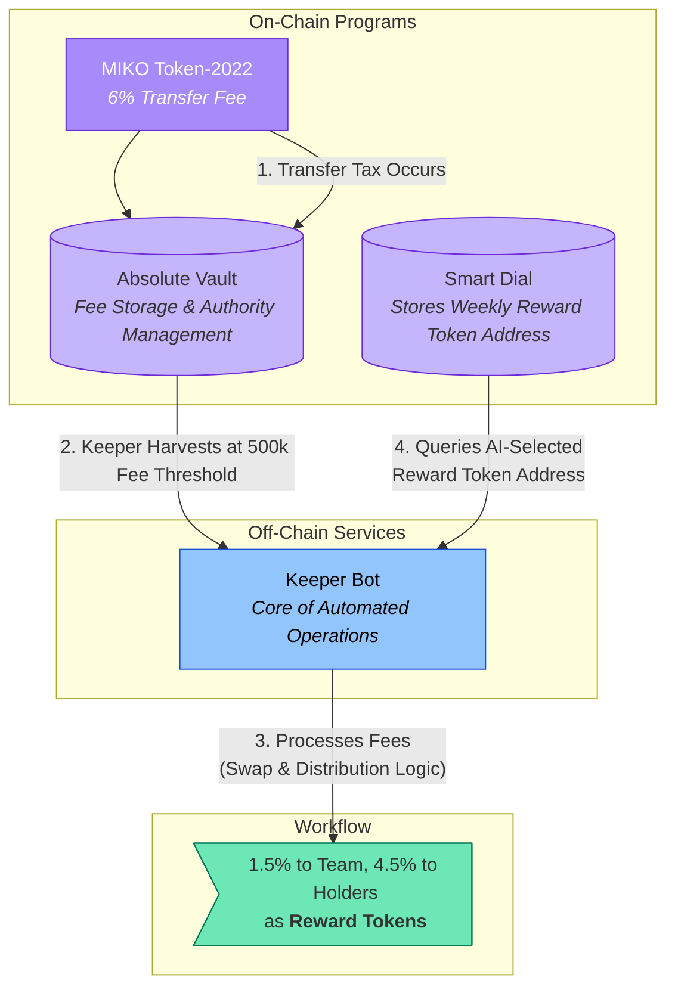

# On-Chain Implementation on Solana

The off-chain analysis results from the Miko AI Agent are executed through the organic collaboration of robust, transparent smart contracts on the Solana blockchain and intelligent automation bots. This hybrid system aims to maximize off-chain flexibility and efficiency while ensuring on-chain immutability and transparency.

## 1. Core On-Chain Components

The on-chain programs form the foundation of the protocol's trust and security, performing only the minimum necessary functions to reduce the attack surface and increase predictability.

-   **MIKO Token (Based on `Token-2022`):** The protocol's core asset, which imposes a fixed 6% fee on all transfers (buys, sells, wallet-to-wallet) without exception, via the TransferFeeConfig extension. The mint authority is renounced and the freeze authority is disabled, making the token immutable with a permanently fixed total supply.
-   **Absolute Vault:** A smart contract that acts as the protocol's central treasury. It securely manages all transferred authorities, stores the transaction fees harvested by the Keeper Bot, and records all activities on-chain for complete transparency.
-   **Smart Dial:** A simple yet crucial on-chain configuration program that stores the address of the weekly reward token. The Keeper Bot queries this contract during each weekly reward distribution to proceed with the swap for the latest AI-selected reward token.

## 2. Off-Chain Automation: The Keeper Bot

The Keeper Bot is an intelligent off-chain automation service responsible for the MIKO ecosystem's operations. By handling complex logic and periodic tasks off-chain, it reduces on-chain transaction costs and ensures system flexibility.

### Key Responsibilities:

-   **Automatic Harvesting:** Continuously monitors the accumulated withheld transaction fees on the token. When the threshold of 0.05% of the total supply (500,000 MIKO) is reached, it automatically harvests the fees and transfers them to the Absolute Vault.
-   **Swap and Distribution Execution:** Swaps the harvested MIKO tokens for the AI-selected weekly reward token, and distributes 25% to the project's operational fund and 75% to eligible holders on a pro-rata basis.
-   **Dynamic Eligibility Screening:** At the time of reward distribution, it scans holder wallets in real-time to distribute rewards only to 'Eligible Holders' with a MIKO token value of $100 or more.
-   **Smart Exclusion System:** Dynamically detects and excludes system-related addresses, such as liquidity pool (LP) accounts or routing contract addresses, from reward distribution to ensure benefits go only to actual community members.

Thus, while the on-chain programs enforce the 'rules' and protect the 'assets', the off-chain Keeper Bot acts as the heart of the ecosystem, 'executing' according to those rules.
