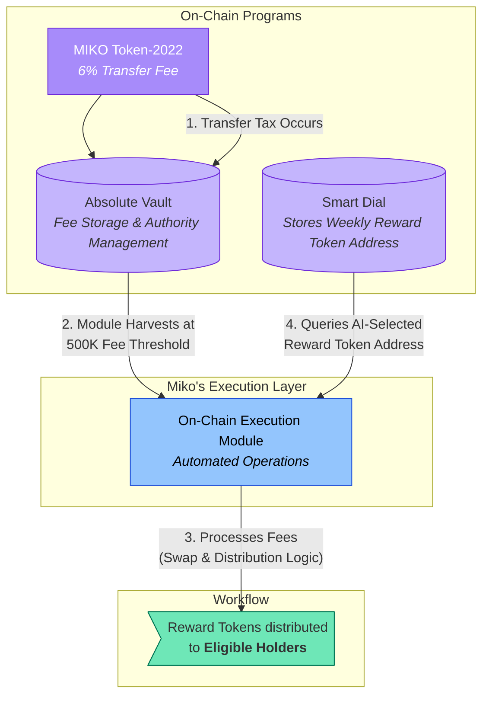
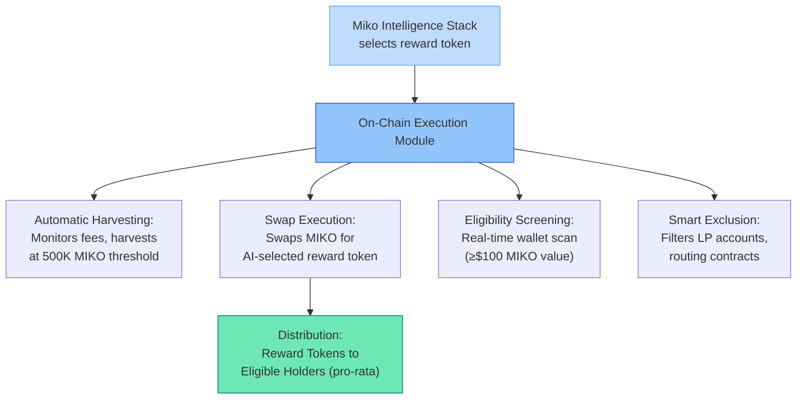

# On-Chain Implementation on Solana

Miko's intelligence stack produces analytical decisions off-chain. These decisions are executed on the Solana blockchain through the organic collaboration of immutable smart contracts and Miko's on-chain execution module. This hybrid architecture maximizes off-chain analytical flexibility while ensuring on-chain transparency and immutability.

```mermaid
graph TD
    subgraph "On-Chain Programs"
        A["MIKO Token-2022<br><i>6% Transfer Fee</i>"] --> B
        B[("Absolute Vault<br><i>Fee Storage & Authority Management</i>")]
        C[("Smart Dial<br><i>Stores Weekly Reward Token Address</i>")]
    end
    subgraph "Miko's Execution Layer"
        D["On-Chain Execution Module<br><i>Automated Operations</i>"]
    end
    subgraph "Workflow"
        A -- "1#46; Transfer Tax Occurs" --> B
        B -- "2#46; Module Harvests at<br>500K Fee Threshold" --> D
        C -- "4#46; Queries AI-Selected<br>Reward Token Address" --> D
        D -- "3#46; Processes Fees<br>(Swap & Distribution Logic)" --> E
        E>"Reward Tokens distributed<br>to <b>Eligible Holders</b>"]
    end
    style A fill:#a78bfa,stroke:#6d28d9,color:#fff
    style B fill:#c4b5fd,stroke:#6d28d9
    style C fill:#c4b5fd,stroke:#6d28d9
    style D fill:#93c5fd,stroke:#1d4ed8,color:#000
    style E fill:#6ee7b7,stroke:#047857
```

## 1. Core On-Chain Components

The on-chain programs form the foundation of the protocol's trust and security, performing only the minimum necessary functions to reduce the attack surface and increase predictability.

-   **MIKO Token (Based on `Token-2022`):** The protocol's core asset, which imposes a fixed 6% fee on all transfers (buys, sells, wallet-to-wallet) without exception, via the TransferFeeConfig extension. The mint authority is renounced and the freeze authority is disabled, making the token immutable with a permanently fixed total supply.
-   **Absolute Vault:** A smart contract that acts as the protocol's central treasury. It securely manages all transferred authorities, stores the transaction fees harvested by Miko's execution module, and records all activities on-chain for complete transparency.
-   **Smart Dial:** A simple yet crucial on-chain configuration program that stores the address of the weekly reward token. Miko's execution module queries this contract during each weekly reward distribution to proceed with the swap for the latest AI-selected reward token.

## 2. On-Chain Execution Module

Miko's on-chain execution module is the component that converts the AI's analytical decisions into blockchain transactions. It operates as an integrated part of the Miko system — receiving the reward token selection directly from the intelligence stack and executing the on-chain operations autonomously.

By handling complex swap logic and periodic tasks off-chain while executing final transactions on-chain, it reduces transaction costs and ensures system flexibility without compromising transparency.

### Key Responsibilities:

```mermaid
graph TD
    A["Miko Intelligence Stack<br/>selects reward token"] --> B["On-Chain Execution Module"]
    B --> C["Automatic Harvesting:<br/>Monitors fees, harvests<br/>at 500K MIKO threshold"]
    B --> D["Swap Execution:<br/>Swaps MIKO for<br/>AI-selected reward token"]
    B --> E["Eligibility Screening:<br/>Real-time wallet scan<br/>(≥$100 MIKO value)"]
    B --> F["Smart Exclusion:<br/>Filters LP accounts,<br/>routing contracts"]
    D --> G["Distribution:<br/>Reward Tokens to<br/>Eligible Holders (pro-rata)"]
    style A fill:#bfdbfe,stroke:#60a5fa
    style B fill:#93c5fd,stroke:#1d4ed8
    style G fill:#6ee7b7,stroke:#047857
```

-   **Automatic Harvesting:** Continuously monitors the accumulated withheld transaction fees on the token. When the threshold of 0.05% of the total supply (500,000 MIKO) is reached, it automatically harvests the fees and transfers them to the Absolute Vault.
-   **Swap and Distribution Execution:** Swaps the harvested MIKO tokens for the AI-selected weekly reward token on a Solana DEX and distributes the purchased reward tokens to eligible holders on a pro-rata basis. A portion of the collected tax is allocated to protocol operations to sustain AI agent infrastructure, server costs, and ongoing development.
-   **Dynamic Eligibility Screening:** At the time of reward distribution, it scans holder wallets in real-time to distribute rewards only to 'Eligible Holders' with a MIKO token value of \$100 or more.
-   **Smart Exclusion System:** Dynamically detects and excludes system-related addresses, such as liquidity pool (LP) accounts or routing contract addresses, from reward distribution to ensure benefits go only to actual community members.

The on-chain programs enforce the rules and protect the assets. Miko's execution module acts autonomously within those rules, completing the pipeline from AI analysis to token distribution without manual intervention.
