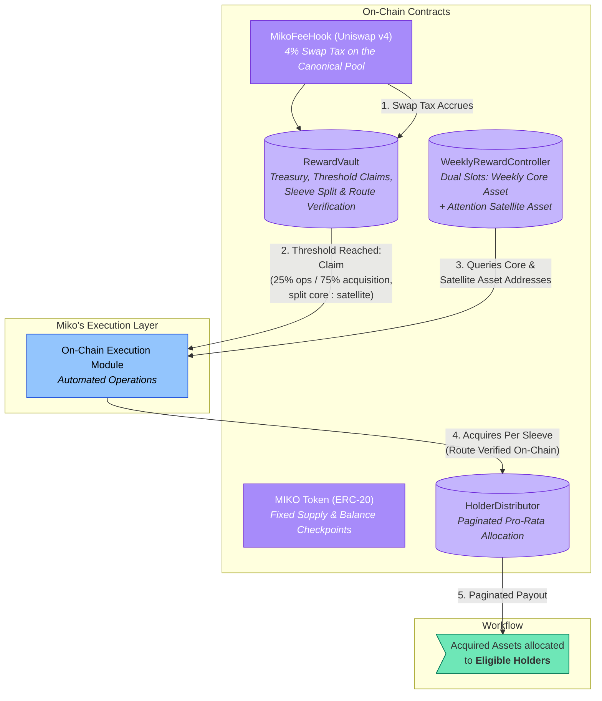

# On-Chain Implementation on Robinhood Chain

Miko's intelligence stack produces analytical decisions off-chain. These decisions are executed on Robinhood Chain through a set of verified smart contracts and Miko's on-chain execution module. This hybrid architecture maximizes off-chain analytical flexibility while ensuring on-chain transparency: every deployed contract is verifiable against its published source code, so any change to on-chain logic is itself public.


```mermaid
graph TD
    subgraph "On-Chain Contracts"
        A["MIKO Token (ERC-20)<br><i>Fixed Supply & Balance Checkpoints</i>"]
        H["MikoFeeHook (Uniswap v4)<br><i>4% Swap Tax on the Canonical Pool</i>"] --> B
        B[("RewardVault<br><i>Treasury, Threshold Claims,<br/>Sleeve Split & Route Verification</i>")]
        C[("WeeklyRewardController<br><i>Dual Slots: Weekly Core Asset<br/>+ Attention Satellite Asset</i>")]
        F[("HolderDistributor<br><i>Paginated Pro-Rata Allocation</i>")]
    end
    subgraph "Miko's Execution Layer"
        D["On-Chain Execution Module<br><i>Automated Operations</i>"]
    end
    subgraph "Workflow"
        H -- "1#46; Swap Tax Accrues" --> B
        B -- "2#46; Threshold Reached:<br/>Claim<br/>(25% ops / 75% acquisition,<br/>split core : satellite)" --> D
        C -- "3#46; Queries Core &<br/>Satellite Asset Addresses" --> D
        D -- "4#46; Acquires Per Sleeve<br/>(Route Verified On-Chain)" --> F
        F -- "5#46; Paginated Payout" --> E>"Acquired Assets allocated<br>to <b>Eligible Holders</b>"]
    end
    style A fill:#a78bfa,stroke:#6d28d9,color:#fff
    style H fill:#a78bfa,stroke:#6d28d9,color:#fff
    style B fill:#c4b5fd,stroke:#6d28d9
    style C fill:#c4b5fd,stroke:#6d28d9
    style F fill:#c4b5fd,stroke:#6d28d9
    style D fill:#93c5fd,stroke:#1d4ed8,color:#000
    style E fill:#6ee7b7,stroke:#047857
```

## 1. Core On-Chain Contracts

The on-chain contracts form the foundation of the protocol's trust and security, performing only the minimum necessary functions to reduce the attack surface and increase predictability.

-   **MIKO Token (ERC-20):** The protocol's core asset. The total supply is fixed at deployment with no mint function, and the contract exposes no owner controls over balances, fees, or trading. Every transfer writes a balance checkpoint, giving the protocol an on-chain, manipulation-resistant record of who held what at each allocation snapshot. Protocol accounts (the liquidity position, protocol contracts, and team custody addresses) are excluded from allocations by a list fixed in the constructor. After deployment the list is append-only — new system accounts can be excluded as the protocol grows, and no exclusion can ever be reversed.
-   **MikoFeeHook (Uniswap v4 Hook):** Enforces the 4% swap tax (`FEE_BPS = 400`) on the ETH side of every trade in the canonical MIKO/ETH pool, in both directions, and forwards the proceeds directly to the RewardVault. The steady rate is immutable, wallet-to-wallet transfers are untaxed, and the pool's own LP fee is set to zero, so the stated 4% is the entire trading cost.
    -   **Anti-Sniping Launch Fee:** For launch fairness, a surcharge applies for the first 12 minutes of trading only: it starts at +60% and decays exponentially with a 158-second time constant, making bot sniping at the opening block economically irrational while leaving the steady 4% untouched from minute 12 onward. The surcharge falls below 10% at 4 minutes 43 seconds and cuts to exactly 0 at the 12-minute mark.

        ```mermaid
        xychart-beta
            title "Anti-sniping surcharge over the first 12 minutes"
            x-axis ["0:00", "1:00", "2:00", "3:00", "4:00", "4:43", "5:00", "6:00", "7:00", "8:00", "9:00", "10:00", "11:00", "12:00"]
            y-axis "Surcharge (%)" 0 --> 60
            line [60, 41.04, 28.07, 19.2, 13.14, 10, 8.99, 6.15, 4.2, 2.88, 1.97, 1.35, 0.92, 0]
        ```
-   **RewardVault:** The protocol treasury. Accrued tax accumulates until it reaches the claim threshold (the value of 500,000 MIKO, roughly 0.05% of supply, converted on-chain at claim time). Each claim splits the accumulated ETH — 25% funds protocol operations, 75% funds acquisition, which is further divided between the core sleeve (weekly selected asset) and the satellite sleeve (community attention leader) at the controller's ratio — and the vault verifies the execution module's swap route byte-by-byte on-chain before any funds move. Each sleeve's purchase resolves independently, so a delay in one never blocks the other.
-   **WeeklyRewardController:** Stores two asset slots. The **core slot** holds the weekly selected asset: the execution module applies the AI's routine selection once per weekly cycle, and a separate emergency change (limited to once per cycle) exists to protect holders if a selected asset suffers a sudden critical event such as a rug pull. The **satellite slot** holds the current community attention leader and can rotate whenever MIKO's evidence gates confirm a genuine leader change. The core/satellite funding ratio can be tuned only within bounds fixed immutably at deployment, and every change to either slot is an on-chain event with full history.
-   **HolderDistributor:** Executes the allocation. Activation, holder-snapshot capture, and payout run as paginated steps, so distribution scales with the holder base. Eligibility (at least \$100 of MIKO) is computed on-chain at claim time from a Chainlink ETH/USD feed and the canonical pool's spot price.
-   **MikoLiquidityVault:** Holds the protocol's liquidity position in the canonical pool, locked for 12 months.

## 2. On-Chain Execution Module

Miko's on-chain execution module is the component that converts the AI's analytical decisions into blockchain transactions. It operates as an integrated part of the Miko system, receiving the asset selection directly from the intelligence stack and executing the on-chain operations autonomously.

### Key Responsibilities:

-   **Threshold Monitoring and Claiming:** Monitors the accumulated tax in the RewardVault and triggers the claim when the threshold is reached.
-   **Swap Execution:** Builds the swap routes from the treasury's ETH into the selected assets — one route per sleeve. Each route is submitted to the RewardVault, which validates it on-chain before execution — the module cannot redirect funds anywhere the contracts do not allow.
-   **Weekly Selection Application:** Applies the intelligence stack's weekly selection to the controller's core slot at the start of each cycle.
-   **Satellite Rotation Application:** Applies confirmed attention-leader changes to the controller's satellite slot, exactly as published by the intelligence stack's gated tracking — strictly ordered, replay-protected, and committed only after on-chain confirmation.
-   **Distribution Paging:** Drives the HolderDistributor through its capture and payout pages until every eligible holder is paid.

The contracts enforce the rules and custody the assets; the module keeps the pipeline running so holders receive their allocations reliably — claim after claim, week after week — without anyone needing to press a button.
